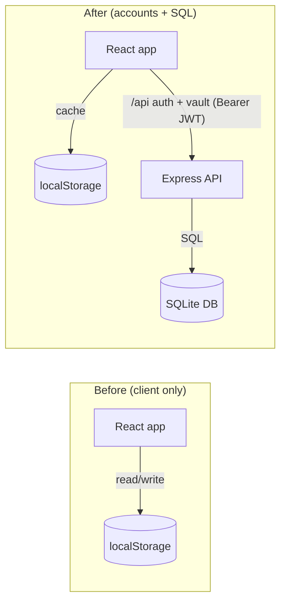
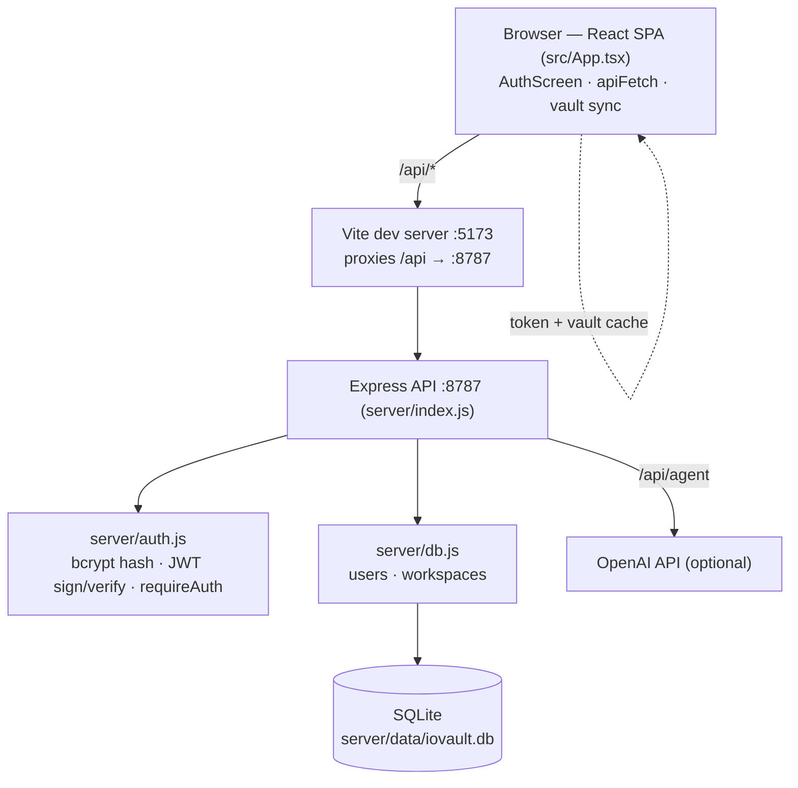
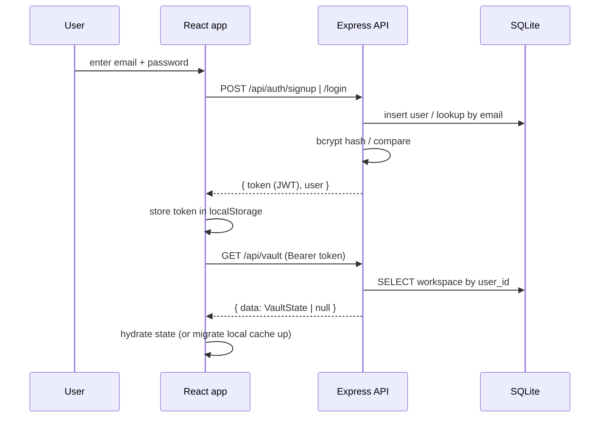
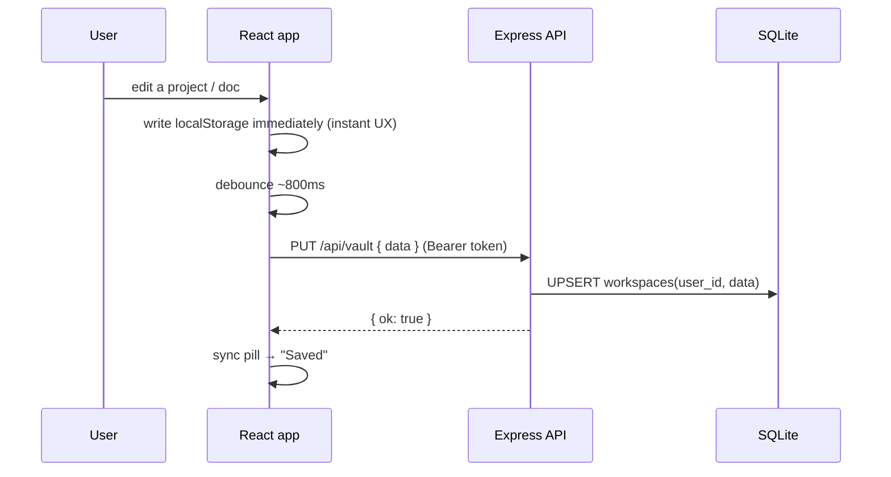

# Architecture — Server, Auth & SQL Sync

Visual overview of how IO Vault changed from a purely client-side app (browser `localStorage`) to a signed-in app whose data is stored per user in a SQL database.

## Before vs after



## Components



## Data model

```mermaid
erDiagram
  USERS ||--o| WORKSPACES : has
  USERS {
    text id PK
    text email UK
    text password_hash
    text created_at
  }
  WORKSPACES {
    text user_id PK_FK
    text data "JSON: full VaultState"
    text updated_at
  }
```

## Auth flow (sign up / sign in)



## Vault save (debounced sync on edit)



## Endpoints

| Method | Path | Auth | Purpose |
| --- | --- | --- | --- |
| POST | `/api/auth/signup` | – | Create account → `{ token, user }` |
| POST | `/api/auth/login` | – | Verify credentials → `{ token, user }` |
| GET | `/api/auth/me` | Bearer | Current user |
| GET | `/api/vault` | Bearer | Load the user's `VaultState` (or `null`) |
| PUT | `/api/vault` | Bearer | Upsert the user's `VaultState` |
| POST | `/api/agent` | – | Existing AI assistant route (unchanged) |

See [`server-and-auth.md`](./server-and-auth.md) for implementation details and the path to swap SQLite for hosted Postgres (Supabase/Neon) in production.
