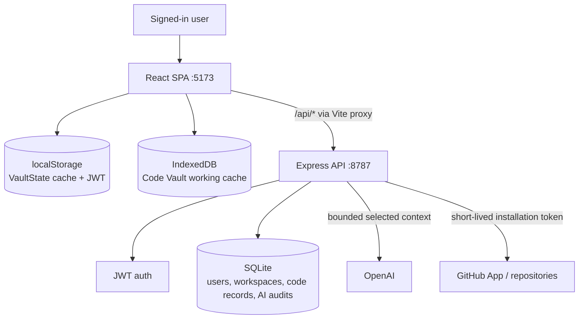
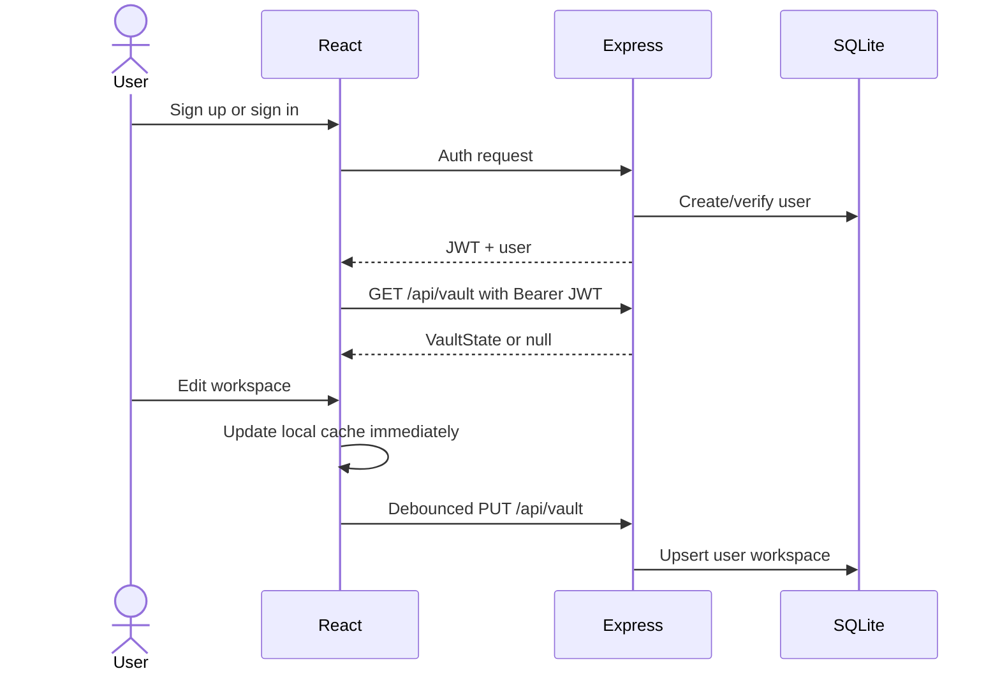

# IO Vault Architecture

IO Vault is a Vite/React SPA backed by an Express API and SQLite. Browser caches keep editing responsive; authenticated server storage is authoritative for user-owned records, while GitHub remains authoritative for connected repository files.

## System map

## Ownership boundaries

| Data | Durable source | Browser copy | Notes |
|---|---|---|---|
| General workspace | SQLite `workspaces.data` | localStorage cache | Full `VaultState`; last-write-wins remains a known limitation |
| Code snippets and notes | `VaultState` via SQLite | React/localStorage | Reusable globally; optional repository provenance |
| Scratch files | SQLite code tables | IndexedDB working cache | User-scoped |
| GitHub files | GitHub repository | IndexedDB bounded cache | Not stored in `VaultState` |
| AI patch sets/publications | SQLite | Active React review state | Published changes become GitHub commits/PRs |
| AI usage | SQLite metadata only | None | Never stores prompts or vault content |

## Main flows

### Authentication and workspace sync

### AI context policy

The general assistant sends no vault context by default. A visible checkbox can include only a bounded summary of the active page. The server ignores legacy `vaultData`, caps selected context at 64 KB, authenticates and rate-limits requests, and stores content-free usage metadata. Code Vault has a separate selected-file patch workflow documented in [code-vault-architecture.md](code-vault-architecture.md).

## Core endpoints

| Group | Routes | Auth | Responsibility |
|---|---|---|---|
| Auth | `/api/auth/signup`, `/login`, `/me` | Public login/signup; Bearer for `/me` | User identity |
| Vault | `GET/PUT /api/vault` | Bearer | Load/save `VaultState` |
| General AI | `POST /api/agent` | Bearer + limits | Context-minimized assistant |
| Code Vault | `/api/code/github/*`, `/scratch/*`, `/assist/stream`, `/publish` | Bearer | Repository, scratch, AI patch, and PR workflows |

## Known constraints

Browser-readable JWTs, the development JWT-secret fallback, whole-workspace JSON persistence, and last-write-wins sync are tracked in [debug-system](debug-system/issue-register.md).
