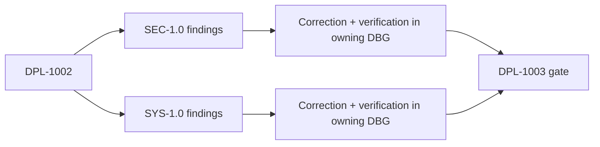

# Audit System

Every evidence-driven DBG belongs to exactly one baseline and keeps its problem, correction, status, limits, and verification there.

| Lane | Scope | Findings |
|---|---|---|
| [SEC-1.0](SEC-1.0-security-baseline.md) | Security, privacy, abuse, validation, dependency integrity | DBG-1002–1006, 1011–1013 |
| [SYS-1.0](SYS-1.0-system-baseline.md) | Architecture, reliability, performance, persistence, maintainability, UI systems | DBG-1001, 1007–1010, 1014–1017 |

## Finding register

| DBG | Lane | Status | Finding |
|---|---|---|---|
| DBG-1001 | SYS | ✅ Verified | Responsive shell gap |
| DBG-1002 | SEC | ✅ Verified | Unauthenticated AI endpoint |
| DBG-1003 | SEC | ✅ Verified | Entire vault sent to OpenAI |
| DBG-1004 | SEC | ✅ Verified | JWT stored in localStorage |
| DBG-1005 | SEC | Open | Production JWT-secret fallback |
| DBG-1006 | SEC | Open | Incomplete rate limiting |
| DBG-1007 | SYS | Open | Workspace JSON blob |
| DBG-1008 | SYS | Open | Conflict-unsafe synchronization |
| DBG-1009 | SYS | Open | App component monolith |
| DBG-1010 | SYS | Open | Server monolith |
| DBG-1011 | SEC | Open | Rich-text sanitization |
| DBG-1012 | SEC | Open | Inconsistent input validation |
| DBG-1013 | SEC | Open | Dependency integrity and drift |
| DBG-1014 | SYS | Open | Package separation |
| DBG-1015 | SYS | Open | Monaco and React state pressure |
| DBG-1016 | SYS | Open | Shared UI/navigation inconsistency |
| DBG-1017 | SYS | ✅ Verified | Typed table-column behavior |

## Verified evidence

| DBG | Evidence |
|---|---|
| DBG-1001 | Production build and 1280×800/390×844 browser checks |
| DBG-1002 | 15 tests and production build |
| DBG-1003 | 17 tests and production build |
| DBG-1004 | 20 tests and production build |
| DBG-1017 | 30 tests, production build, signed-in browser workflow |

Audit records contain no speculative product outcomes. Verified results flow into the [Deployment Ledger](../deployment-ledger/README.md); future product behavior remains in DPL and IMP.
