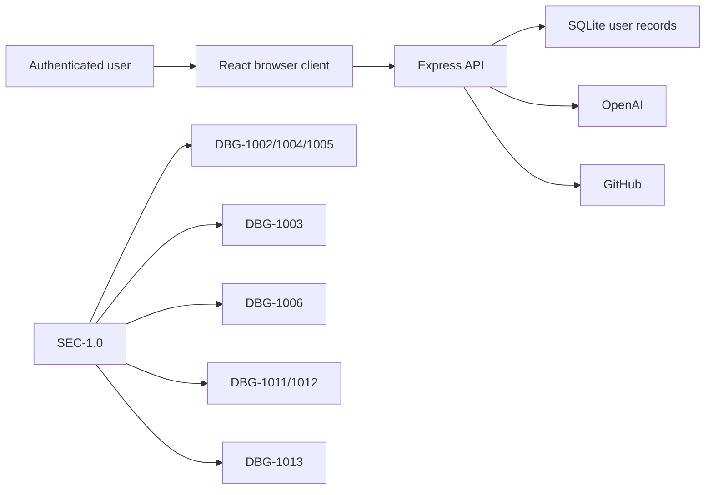

# SEC-1.0 — Security and Privacy Baseline

Evidence-driven security, privacy, abuse, validation, and dependency-integrity findings for Version 1.0. Corrections remain in the DBG that produced them.

| DBG | Status | Finding | Impact |
|---|---|---|---|
| DBG-1002 | ✅ Verified | Anonymous AI access | Authentication and AI cost |
| DBG-1003 | ✅ Verified | Excessive private AI context | Privacy, cost, latency |
| DBG-1004 | ✅ Verified | Browser-stored JWT | Browser sessions and private data |
| DBG-1005 | ✅ Verified | Production secret fallback | Session integrity |
| DBG-1006 | Open | Incomplete route limits | Abuse, cost, availability |
| DBG-1011 | Open | Rich-text sanitization | Stored content and browser security |
| DBG-1012 | Open | Inconsistent input validation | Every write/expensive route |
| DBG-1013 | Open | Dependency integrity and drift | Build and supply-chain confidence |

## DBG-1002 — Unauthenticated AI endpoint

**Verified · Critical · 2026-07-19.** `/api/agent` lacked authentication and the client used raw `fetch`, permitting anonymous provider use. The correction added authenticated requests, 10/user/min and 30/IP/min limits, 8,000-character messages, 64 KB selected context, a 30-second timeout, and content-free SQLite auditing. Fifteen tests and the build passed. Counters remain process-local.

## DBG-1003 — Entire vault sent to OpenAI

**Verified · Critical · 2026-07-20.** The client sent `vaultState` and the server serialized it for every request. Context is now empty by default, active-page opt-in is visible and bounded, legacy `vaultData` is ignored, and tests prove unrelated pages/secrets are excluded. Seventeen tests and the build passed; selected context can intentionally omit useful information.

## DBG-1004 — JWT stored in localStorage

**Verified · Critical · 2026-07-21.** The SPA exposed `io-vault-token` and auth responses returned JWTs. Browser auth now uses an HttpOnly SameSite cookie, `Secure` in production, CSRF protection for cookie mutations, logout clearing, and legacy-token removal. Bearer auth remains for non-browser clients. Twenty tests and the build passed.

## DBG-1005 — Production JWT-secret fallback

**Verified · Critical · discovered 2026-07-19; corrected 2026-08-11.** Production now rejects missing, placeholder, short, and low-diversity JWT secrets before the API listens. Deployment-provided `NODE_ENV` and `JWT_SECRET` remain authoritative over local environment files, while the intentional fallback remains limited to development and test. Focused configuration tests, hostile-environment subprocess checks, the isolated application suite, and the production build passed. Managed secret rotation remains an operational deployment responsibility.

## DBG-1006 — Incomplete rate limiting

**Open · Critical · discovered 2026-07-19.** Only `/api/agent` uses focused limits; auth, GitHub, vault, and code routes lack quotas. Add route-specific IP/user quotas, concurrency/body limits, and shared counters for distributed deployment. Verify thresholds, isolation, expiry, concurrency, and `Retry-After` per route.

## DBG-1011 — Rich-text sanitization

**Open · High · discovered 2026-07-19.** `RichEditor` stores and assigns `innerHTML` without an explicit sanitizer, creating stored-XSS risk. Apply allowlist sanitization at ingress and every HTML sink, preserve a migration backup, and verify malicious fixtures through render and persistence.

## DBG-1012 — Inconsistent input validation

**Open · High · discovered 2026-07-19.** Server routes use varied manual checks. Adopt shared boundary schemas with normalized output and consistent errors; verify boundary and malformed payloads for every write and expensive route. Stricter contracts may reject formerly accepted payloads.

## DBG-1013 — Dependency integrity and drift

**Open · Medium · discovered 2026-07-19.** Core packages use `latest` and caret ranges. Pin reviewed versions and automate gated update PRs. Verify clean install, tests, build, and dependency audit; deliberate updates become required maintenance.
