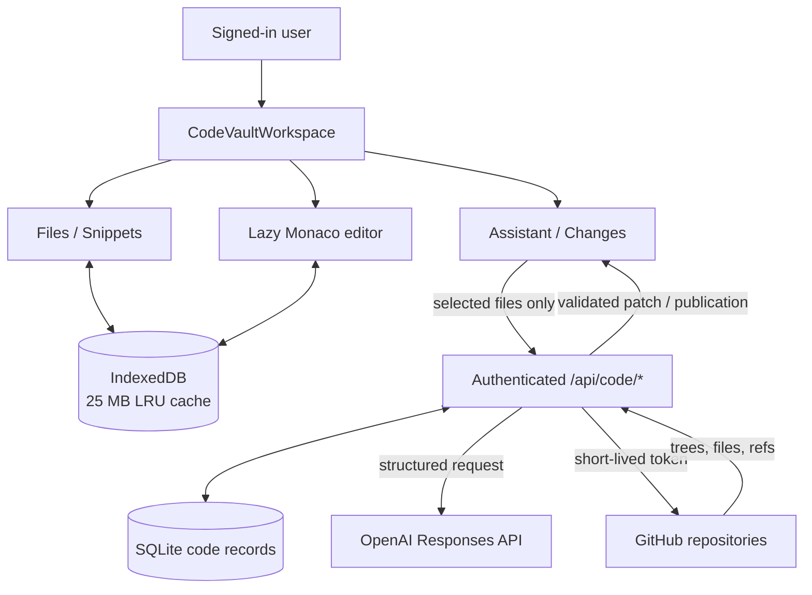

# Code Vault Architecture

Code Vault separates repository truth, browser working state, durable user records, and AI proposals so large files do not enter the general `VaultState` sync path.

## Components

| Layer | Responsibility | Source / destination |
|---|---|---|
| Explorer | Repository selection, file tree, scratch files, global snippets | GitHub API, IndexedDB, workspace snippets |
| Monaco workbench | Tabs, syntax, editing, dirty state, context selection | Active `CodeFile` models and IndexedDB |
| Assistant/Changes | Selected context, structured patch, per-file review, apply/undo | `/api/code/assist/stream`, SQLite patch sets |
| Express code routes | Authentication, path/size limits, AI/GitHub orchestration | `/api/code/*` |
| SQLite | Scratch files, installation IDs, sessions, patches, publications | Durable user-scoped records |
| GitHub App | Trees/files and reviewed publication | Short-lived installation token |
| OpenAI | Explanations and structured file operations | Maximum 12 selected files; optional scratchpad |

## System map



## Storage ownership

| Data | Working copy | Durable source |
|---|---|---|
| Connected repository file | Monaco + IndexedDB | GitHub |
| Unsaved repository edit | Monaco + IndexedDB | None until reviewed publication |
| Scratch file | Monaco + IndexedDB | SQLite |
| Snippet and provenance | React view | `VaultState` via workspace sync |
| Task scratchpad | React view | `VaultState` notes |
| Patch set / publication | Active review | SQLite; published result in GitHub |
| Installation token | Server memory only | GitHub-generated, short-lived |

## AI and publication sequence

```mermaid
sequenceDiagram
  actor U as User
  participant UI as Code Vault
  participant API as Express
  participant AI as OpenAI
  participant DB as SQLite
  participant GH as GitHub
  U->>UI: Check files and submit task
  UI->>API: Authenticated selected context
  API->>API: Validate count, size, and paths
  API->>AI: Task + selected files
  AI-->>API: Structured explanation + operations
  API->>API: Validate every proposed operation
  API->>DB: Save owned patch set
  API-->>UI: Stream result
  U->>UI: Accept/reject and apply/undo
  opt Publish
    UI->>API: Approved changes + patch set ID
    API->>GH: Revalidate base SHA
    alt Current
      API->>GH: Atomic tree + commit + new branch + draft PR
      API->>DB: Save publication history
    else Stale
      API-->>UI: 409 conflict; no mutation
    end
  end
```

## Safety limits

- Authentication and user ownership on every Code Vault endpoint.
- Safe relative repository paths; dependency, build, secret, ignored, binary, and oversized files rejected.
- Explicit AI context only; optional scratchpad is opt-in.
- Patch operations validated before storage and again before publication.
- No force push, existing-branch overwrite, terminal, code execution, or automatic dependency installation.

## Known tradeoffs

Monaco models, React file state, undo snapshots, and IndexedDB can temporarily duplicate file contents. Profile realistic repositories before changing this architecture; see DBG-1014.
