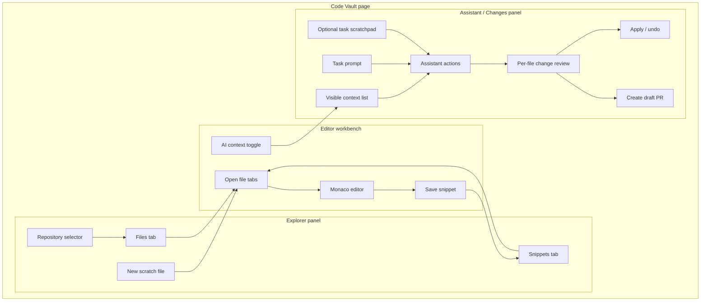
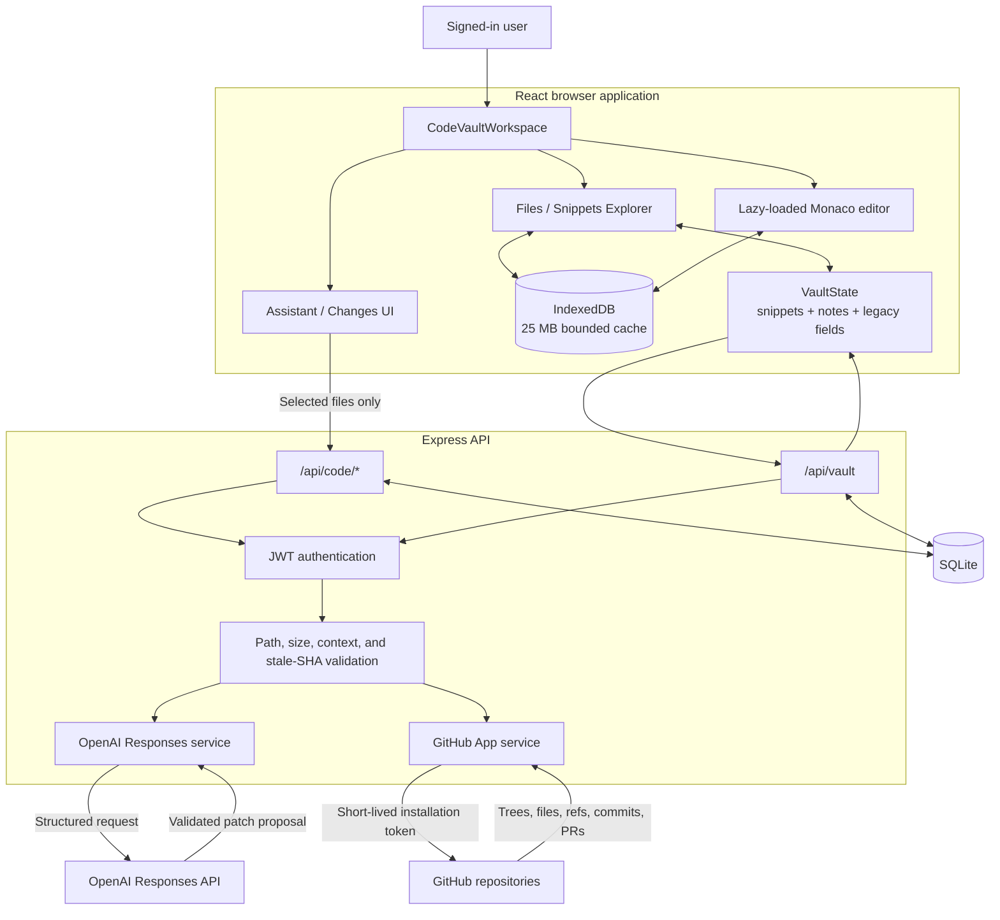
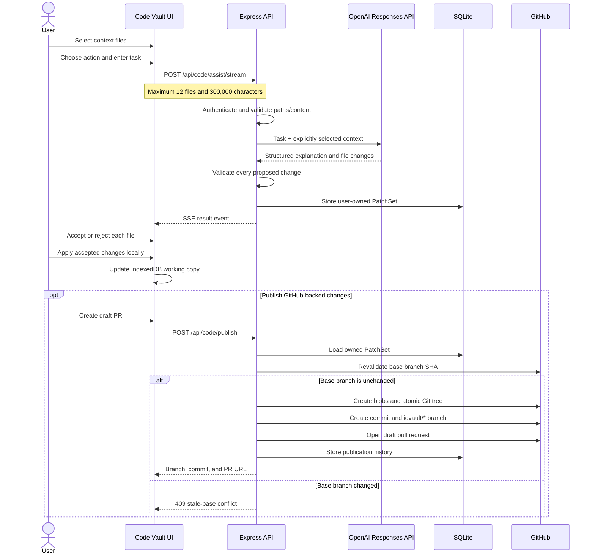
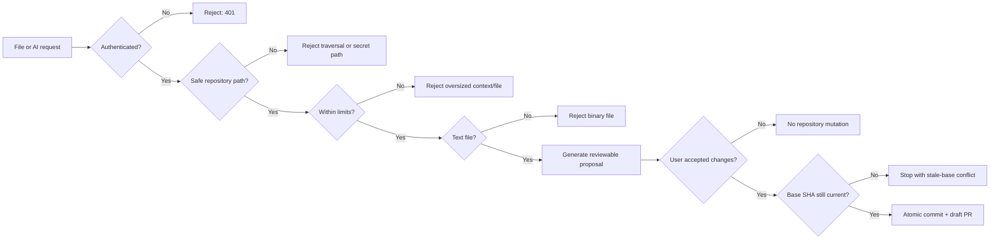

# Code Vault Page Architecture

Code Vault is a browser mini IDE built around three visible work areas: an Explorer, a Monaco editor, and an AI Assistant/Changes panel. GitHub is the source of truth for repositories, IndexedDB is the fast browser cache, and SQLite stores durable user-owned workspace records.

## Architecture chart

| Layer | Component | Responsibility | Reads from | Writes to |
| --- | --- | --- | --- | --- |
| UI | Files/Snippets Explorer | Select repositories, open files, create scratch files, and reuse snippets | GitHub repository API, IndexedDB, `VaultState` | Active workspace and file selection |
| UI | Monaco Editor | Edit text files with syntax highlighting, tabs, diagnostics, and dirty-state tracking | Opened `CodeFile` records | IndexedDB and durable scratch-file API |
| UI | Assistant | Select an AI action, model tier, context files, prompt, and optional scratchpad | Checked editor files and Code Vault notes | `/api/code/assist/stream` |
| UI | Changes Review | Review, accept, reject, apply, undo, and publish proposed file changes | Stored `PatchSet` | Local working files and `/api/code/publish` |
| Browser storage | IndexedDB | Cache opened repository files and immediate scratch edits with LRU eviction | GitHub/API responses | Maximum approximately 25 MB of browser data |
| App state | `VaultState` | Preserve snippets, notes, legacy code fields, and navigation settings | SQLite workspace JSON and `localStorage` cache | Debounced `/api/vault` synchronization |
| API | Express Code Vault routes | Authenticate requests, enforce limits, coordinate AI and GitHub operations | Bearer JWT, request payloads | SQLite, OpenAI, and GitHub APIs |
| Database | SQLite Code Vault tables | Store scratch files, GitHub installation IDs, AI patch sets, sessions, and publication history | Express server | Durable user-scoped records |
| AI | OpenAI Responses API | Explain code and generate structured, complete-file patch proposals | Maximum 12 explicitly selected files and optional scratchpad | Validated structured `PatchSet` |
| Repository | GitHub App integration | Read repository trees/files and create branches, commits, and draft pull requests | Short-lived installation token | GitHub repository |

## Page layout map

## System architecture map

## Storage ownership map

| Data | Browser memory | IndexedDB | `VaultState` | SQLite | GitHub |
| --- | :---: | :---: | :---: | :---: | :---: |
| Currently rendered file | Yes | Yes | No | Scratch only | Repository files |
| Open repository file cache | Limited | Yes | No | No | Source of truth |
| Unsaved repository edits | Active files | Yes | No | No | No |
| Scratch files | Active files | Yes | Legacy mirror only | Yes | No |
| Snippets and provenance | Active view | No | Yes | Through vault sync | Optional source reference |
| Task notes | Active view | No | Yes | Through vault sync | No |
| AI patch sets | Active review | No | No | Yes | Published result only |
| GitHub installation token | No | No | No | No | Generated temporarily |
| GitHub installation ID | No | No | No | Yes | Yes |
| Branches, commits, and PRs | Metadata only | No | No | Publication history | Source of truth |

## AI change workflow

## Safety and resource boundaries

