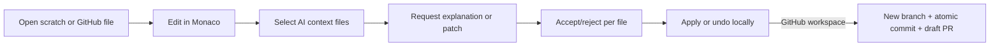

# Code Vault Mini IDE

Code Vault is a three-pane coding workspace: Files/Snippets explorer, lazy-loaded Monaco editor, and Assistant/Changes review panel. It supports scratch work immediately and GitHub-backed work when a GitHub App is configured.

## User workflow

## Capability and boundary chart

| Capability | Behavior | Limit |
|---|---|---|
| Scratch files | Create, rename, edit, delete, cache offline, persist per user | No local-folder access |
| Repository files | Browse and edit text from connected GitHub repositories | Binary/secret/ignored paths excluded; 1 MB/file |
| Monaco | Syntax-aware editing, tabs, search, diagnostics, dirty state | Standalone semantic diagnostics are intentionally conservative |
| Snippets | Global reusable snippets with editable filenames and optional provenance | Stored through workspace state |
| Coding assistant | Ask, explain, review, fix, refactor, test, document | Checked files only; max 12 files / 300k characters |
| Change review | Per-file diff, accept/reject, apply, undo | No automatic mutation before approval |
| Publishing | New `iovault/*` branch, atomic commit, draft PR | No force push; stale SHA stops publication |

Code Vault does not execute code, install dependencies, expose a terminal, or provide live preview.

## GitHub App setup

1. Create a GitHub App and set the local callback/setup URL to `http://localhost:8787/api/code/github/callback`.
2. Grant Metadata read, Contents read/write, Pull requests read/write, and Actions read.
3. Generate a private key and add the values documented in `.env.example` to `.env.local`.
4. Restart `npm run dev`; the Connect action enables when configuration is complete.

Only the installation ID and repository metadata are stored. Installation tokens are generated server-side when needed and expire automatically.

See [code-vault-architecture.md](code-vault-architecture.md) for system design and storage ownership.
