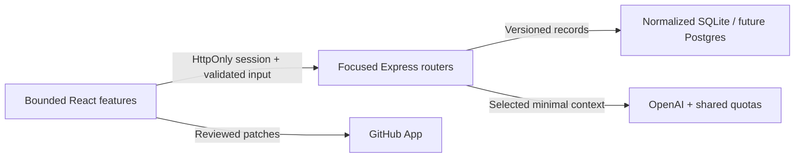

# Target State

```mermaid
flowchart LR
  UI["Bounded React features"] -->|"HttpOnly session + validated input"| API["Focused Express routers"]
  API -->|"Versioned records"| DB["Normalized SQLite / future Postgres"]
  API -->|"Selected minimal context"| AI["OpenAI + shared quotas"]
  UI -->|"Reviewed patches"| GH["GitHub App"]
```

Sanitize rich text, fail closed on production secrets, and keep AI audits content-free.
