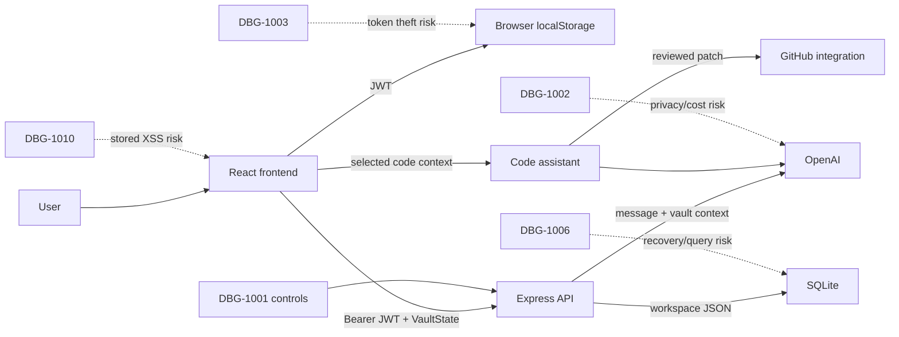

# Sensitive Data Flow and Risk

```mermaid
flowchart LR
  U["User"] --> FE["React frontend"]
  FE -->|"JWT"| LS["Browser localStorage"]
  FE -->|"Bearer JWT + VaultState"| API["Express API"]
  API -->|"workspace JSON"| DB["SQLite"]
  API -->|"message + vault context"| OA["OpenAI"]
  FE -->|"selected code context"| CA["Code assistant"]
  CA --> OA
  CA -->|"reviewed patch"| GH["GitHub integration"]
  D3["DBG-1003"] -. token theft risk .-> LS
  D2["DBG-1002"] -. privacy/cost risk .-> OA
  D6["DBG-1006"] -. recovery/query risk .-> DB
  D10["DBG-1010"] -. stored XSS risk .-> FE
  D1["DBG-1001 controls"] --> API
```
