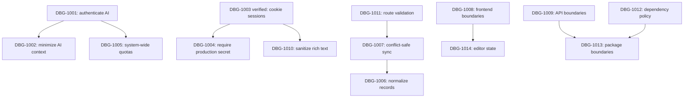

# Risk-Based Fix Order

```mermaid
graph TD
  D1001["DBG-1001: authenticate AI"] --> D1002["DBG-1002: minimize AI context"]
  D1001 --> D1005["DBG-1005: system-wide quotas"]
  D1003["DBG-1003 verified: cookie sessions"] --> D1004["DBG-1004: require production secret"]
  D1003 --> D1010["DBG-1010: sanitize rich text"]
  D1011["DBG-1011: route validation"] --> D1007["DBG-1007: conflict-safe sync"]
  D1007 --> D1006["DBG-1006: normalize records"]
  D1008["DBG-1008: frontend boundaries"] --> D1014["DBG-1014: editor state"]
  D1009["DBG-1009: API boundaries"] --> D1013["DBG-1013: package boundaries"]
  D1012["DBG-1012: dependency policy"] --> D1013
```
