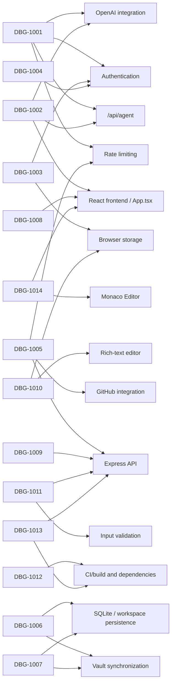

# Issue-to-Service Graph

```mermaid
graph LR
  FE["React frontend / App.tsx"]
  ME["Monaco Editor"]
  RT["Rich-text editor"]
  BS["Browser storage"]
  AU["Authentication"]
  API["Express API"]
  AG["/api/agent"]
  IV["Input validation"]
  RL["Rate limiting"]
  OA["OpenAI integration"]
  SY["Vault synchronization"]
  DB["SQLite / workspace persistence"]
  GH["GitHub integration"]
  CI["CI/build and dependencies"]
  D1["DBG-1001"] --> AG & AU & RL & OA
  D2["DBG-1002"] --> FE & AG & OA
  D3["DBG-1003"] --> BS & AU
  D4["DBG-1004"] --> AU
  D5["DBG-1005"] --> API & RL & GH
  D6["DBG-1006"] --> DB & SY
  D7["DBG-1007"] --> SY & DB
  D8["DBG-1008"] --> FE
  D9["DBG-1009"] --> API
  D10["DBG-1010"] --> RT & BS
  D11["DBG-1011"] --> IV & API
  D12["DBG-1012"] --> CI
  D13["DBG-1013"] --> CI & API
  D14["DBG-1014"] --> ME & FE
```
