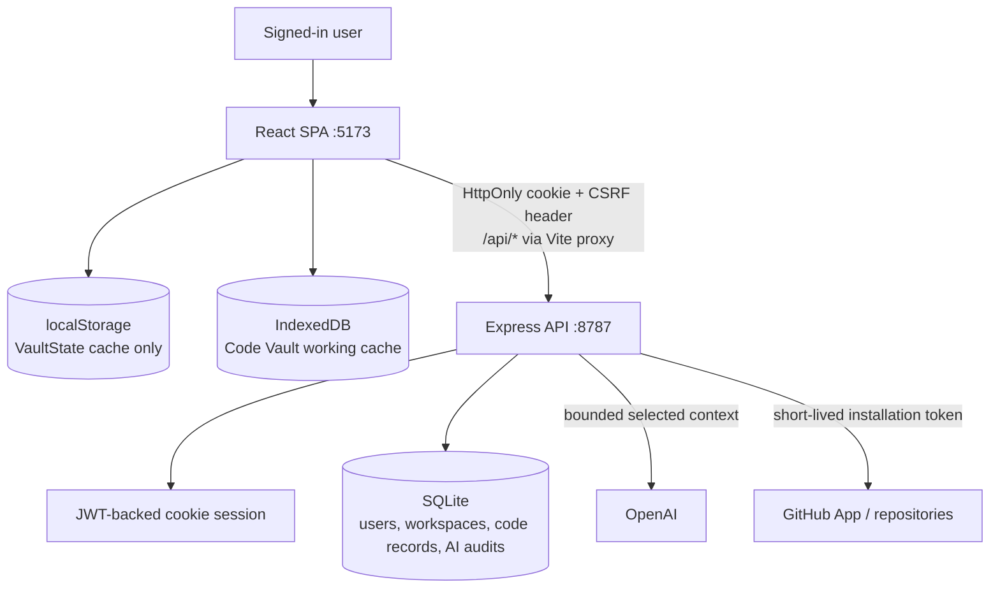
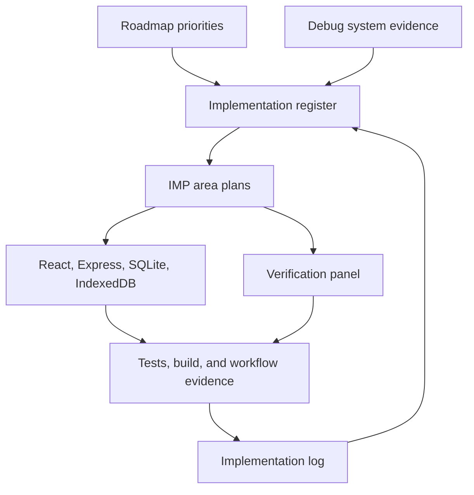
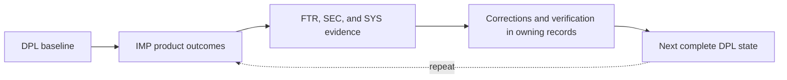
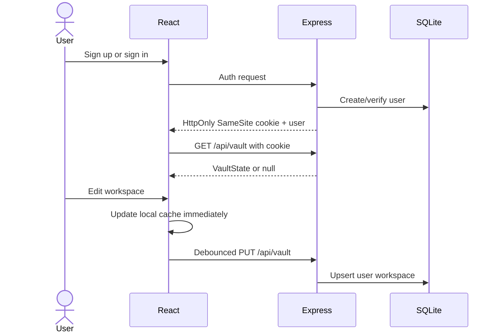
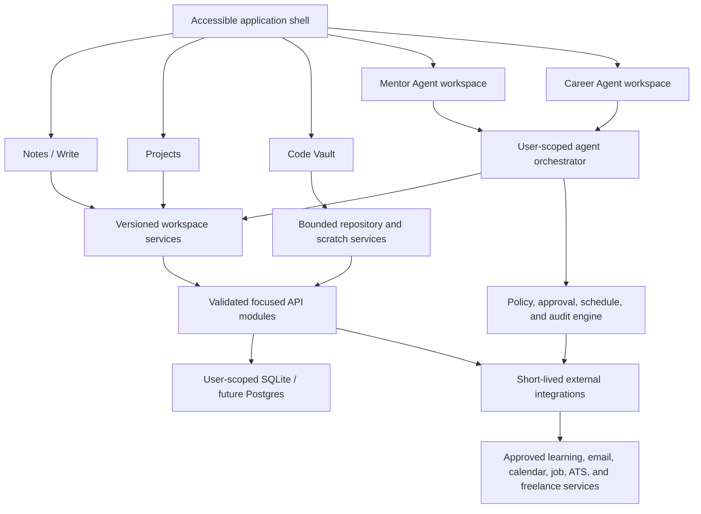
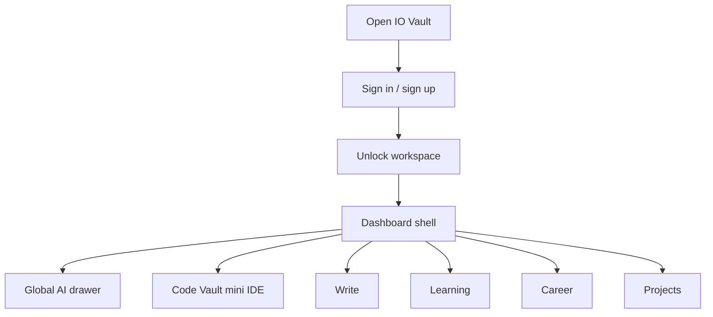
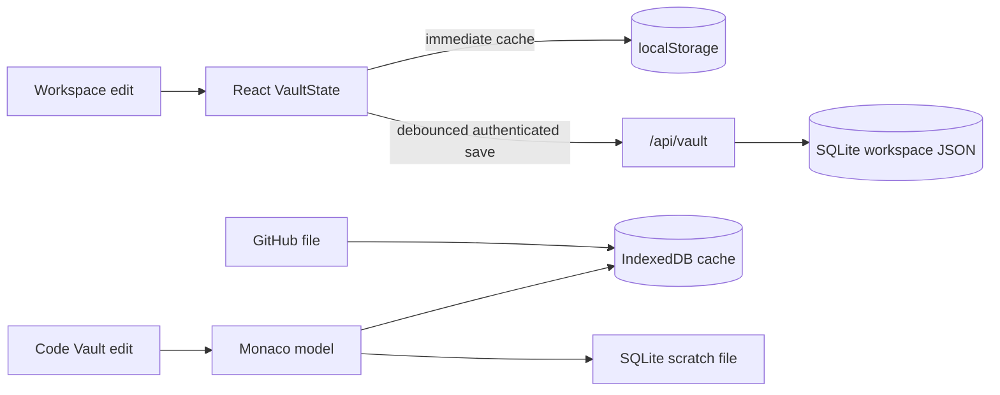
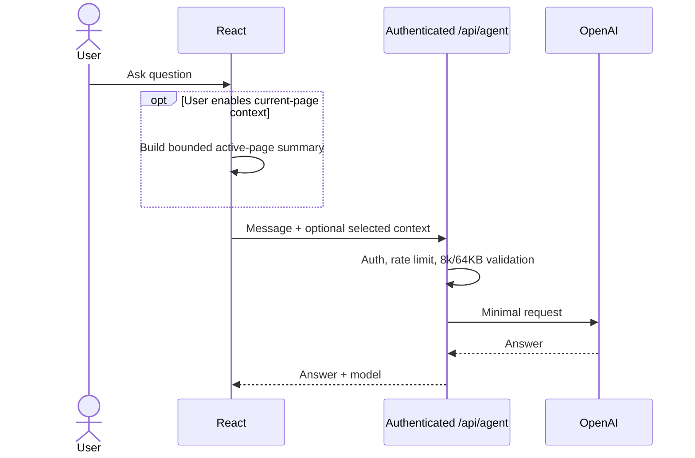

# DPL-1002 — Current Post-Monaco Testing State

| Field | Current state |
|---|---|
| Status | Deployed for testing |
| Date | 2026-07-30 |
| Commit | `73d45ac` baseline; current verified changes pending commit |
| Version | **1.0 — Current** |
| Environment | Repository-backed local testing state; no external production claim |
| Previous state | [DPL-1001](DPL-1001-pre-monaco-state.md) |
| Next state | [DPL-1003](DPL-1003-next-testing-state.md) |

## Complete architecture

| Boundary | Current behavior |
|---|---|
| Frontend | Vite + React + TypeScript application with authenticated workspace pages |
| API | Express API for auth, vault sync, bounded AI, GitHub, scratch files, patches, and publishing |
| Authentication | JWT-backed HttpOnly SameSite cookie with CSRF protection; bearer compatibility for non-browser clients |
| Data | SQLite user/workspace/code records, `localStorage` workspace cache, and bounded IndexedDB Code Vault cache |
| Code Vault | Monaco, scratch and repository files, selected context, structured patch review/undo, and draft PR publication |
| Write | Structured hierarchy with direct drag reordering, advanced typed collections, record-based Relation pickers, guided Formula functions, themed wide-table navigation, embedded Page cells, explicit column editing/sorting, keyboard traversal, normalized external paste, dismissible linked-page overlays, compact glass creation controls, recovery, rich editing, and explicit AI context |
| Settings | Persisted Theme Mode with tinted color tuning, subdued Dark, true-black Night, white Light, additional curated colors, live preview, and a Default control while preserving the animated visual system |
| AI | Authenticated, rate-limited requests with bounded explicit context and content-free usage auditing |

Current runtime detail is consolidated below; Code Vault feature architecture is owned by [IMP-1002](../implementation-system/implementations/IMP-1002-code-vault.md).

## Version 1.0 release manifest

### Product implementations

| Implementation | Included Version 1.0 scope | State |
|---|---|---|
| [IMP-1001 — Write](../implementation-system/implementations/IMP-1001-write.md) | Hierarchical pages, rich editing, advanced typed collections, embedded Page cells, Formula and Relation contracts, explicit column editing/sorting, keyboard traversal, dismissible linked-page overlays, templates, archive recovery, and explicit assistant context | Implemented v1 |
| [IMP-1002 — Code Vault](../implementation-system/implementations/IMP-1002-code-vault.md) | Monaco editing, scratch files, reusable snippets, selected-file AI context, reviewed patches, undo, and GitHub draft-pull-request publishing | Implemented v1 |
| [IMP-1003 — Projects](../implementation-system/implementations/IMP-1003-projects.md) | Project cards, status filters, confirmed deletion, persisted ordering, full-page Rich Text and Markdown, typed tables, and visual Flowchart/Mindmap canvases with editable rectangular nodes and directed arrows | Implemented and verified |
| [IMP-1004 — Learning / Mentor](../implementation-system/implementations/IMP-1004-learning-mentor.md) | Learning notes, connections, and weekly-focus workspace | Partial; Mentor Agent remains planned |
| [IMP-1005 — Career](../implementation-system/implementations/IMP-1005-career.md) | Resume editing and AI-assisted drafting | Partial; Career Agent and platform integrations remain planned |
| [IMP-1006 — Settings](../implementation-system/implementations/IMP-1006-settings.md) | Theme Mode with persisted tinted, Night, and Light contracts, shade/glow/depth controls, presets, live preview, and default restoration | Implemented v1 |

### Verified reviews and corrections

| Record | Included Version 1.0 result | State |
|---|---|---|
| [FTR-1001 — Write manual review](../feature-review-system/reviews/FTR-1001-write-manual-review.md) | Nested rows, page deletion and recovery, collapsible sections, expanded formatting, linked Page columns, drag/keyboard organization, rename, and archive restoration | 8/8 verified |
| [FTR-1002 — Write actions review](../feature-review-system/reviews/FTR-1002-write-actions-review.md) | Foreground page menus, persisted icons, multi-format imports, trigger anchoring, stable page selection, and explicit template add-or-replace choices | 6/6 verified |
| [FTR-1003 — Write table column menu review](../feature-review-system/reviews/FTR-1003-write-table-column-menu-review.md) | Target-specific column and row menus, contextual subrow controls, persisted row highlighting, and confirmed destructive actions | 7/7 verified |
| [FTR-1004 — Write table follow-up review](../feature-review-system/reviews/FTR-1004-write-table-follow-up-review.md) | Linked-page overlays, consolidated foreground row actions, persisted column sizing, expanded icons/imports, individual status options, and compact filters | 11/11 verified |
| [FTR-1005 — Write plus menu review](../feature-review-system/reviews/FTR-1005-write-plus-menu-review.md) | Functional `+` formatting menu, toolbar-area hover activation, embedded-page availability, and foreground anchoring | Partial — 3/4 verified; advanced insertion blocks remain open |
| [FTR-1006 — Write toolbar and table review](../feature-review-system/reviews/FTR-1006-write-toolbar-and-table-review.md) | Hover-bound toolbar, normalized external paste, table keyboard behavior, dismissible sticky linked-page controls, embedded Page cells, guided Formula configuration, explicit column actions, and advanced property types | Verified — 14/14 |
| [FTR-1007 - Write table and navigation review](../feature-review-system/reviews/FTR-1007-write-table-and-navigation-review.md) | Themed wide-table navigation, stable record-based Relation behavior, guided Formula functions, direct explorer drag reordering, and compact glass creation controls | Verified — 7/7 |
| [FTR-1008 - Projects page review](../feature-review-system/reviews/FTR-1008-projects-page-review.md) | Front-card mode and deletion menus, persisted direct drag ordering, separately saved full-page workspaces, larger editable node canvases with corner actions, and functional status filters | Verified — 10/10 |
| [SEC-1.0](../audit-system/SEC-1.0-security-baseline.md) | Authenticated AI access, bounded explicit context, and HttpOnly cookie sessions through DBG-1002–1004 | Three verified; five security findings remain open |
| [SYS-1.0](../audit-system/SYS-1.0-system-baseline.md) | Responsive workspace behavior and reliable typed table-column controls through DBG-1001 and DBG-1017 | Two verified; seven system findings remain open |

## Verification and readiness

| Gate | Result |
|---|---|
| Tests | `npm test`: 12 files and 56 tests passed on 2026-07-30 |
| Production build | `npm run build`: TypeScript and Vite production build passed on 2026-07-30 |
| Database | SQLite schema auto-initializes; whole-workspace JSON and conflict handling remain known limitations |
| Environment/secrets | Local environment supported; production JWT fail-closed validation remains open in DBG-1005 |
| Monitoring | Application-level production monitoring is not established |
| Rollback | Git commit provides source rollback; database rollback procedure is not validated |

Open findings are acceptable for the documented local testing state, not evidence of production readiness.

## Runtime ownership

| Data | Durable authority | Browser copy |
|---|---|---|
| General workspace, Write, snippets, notes | SQLite `workspaces.data` | React and `localStorage` cache |
| Scratch files | User-scoped SQLite code tables | Monaco and bounded IndexedDB |
| GitHub files | GitHub repository | Monaco and bounded IndexedDB |
| Patch sets/publications | SQLite; published output in GitHub | Active review state |
| AI usage | Content-free SQLite metadata | None |

| API group | Routes | Responsibility |
|---|---|---|
| Auth | `/api/auth/signup`, `/login`, `/logout`, `/me` | Cookie identity; CSRF on unsafe cookie requests |
| Vault | `GET/PUT /api/vault` | Load/save the user’s `VaultState` |
| General AI | `POST /api/agent` | Authenticated, rate-limited, context-minimized assistant |
| Code Vault | `/api/code/github/*`, `/scratch/*`, `/assist/stream`, `/publish` | Repository, scratch, patch, and PR workflow |

## Architecture diagrams

### Runtime topology

### Historical implementation-control topology

This superseded topology records the planning controls used before the Deployment Ledger became the project authority.

### Deployment lifecycle

### Authentication and workspace synchronization

### Target service boundaries

### Product navigation

### Persistence flow

### General assistant request

## Security, configuration, and production path

- Browser sessions are HttpOnly, SameSite=Lax, and `Secure` in production; unsafe cookie requests require `X-IOVault-CSRF: 1`.
- Auth responses do not expose JWTs; legacy browser tokens are removed. Bearer auth remains for non-browser clients.
- General AI allows 8,000-character messages and 64 KB selected context, ignores full-vault legacy context, applies a 30-second provider timeout, and records content-free usage metadata.
- `OPENAI_API_KEY` enables AI; `JWT_SECRET` is required for secure production; `DATABASE_FILE` overrides SQLite; GitHub App values are documented in `.env.example`. Restart after environment changes.
- Production readiness requires fail-closed secrets, persistent route quotas, optimistic workspace versions, selective normalization, a shared datastore before multiple API instances, monitoring, and a validated database rollback procedure.
- Narrow screens preserve the desktop workspace and use horizontal scrolling rather than silently changing the information architecture.
