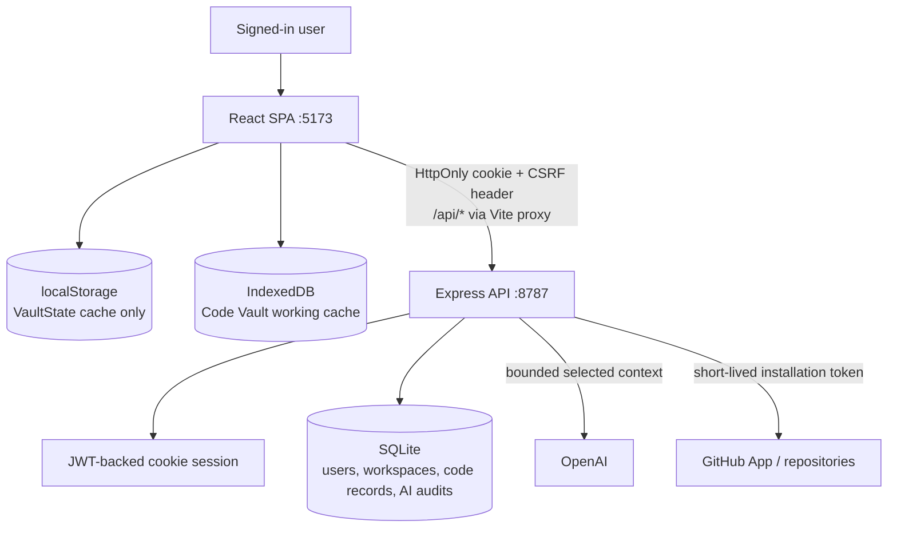
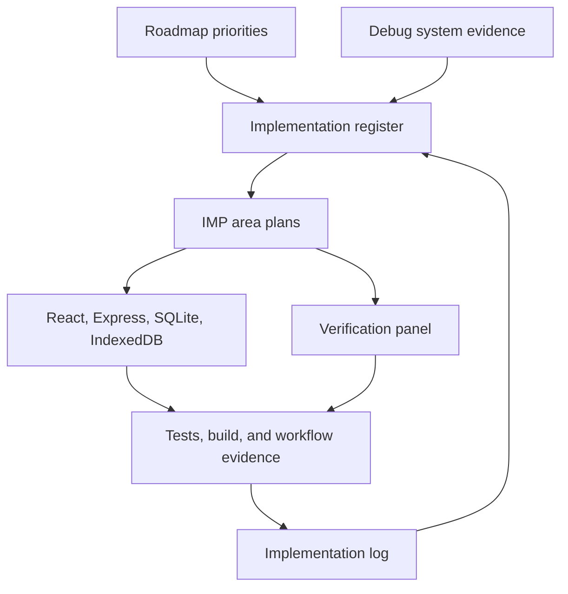
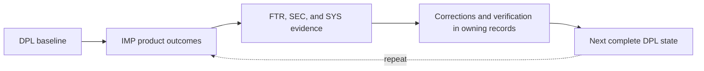
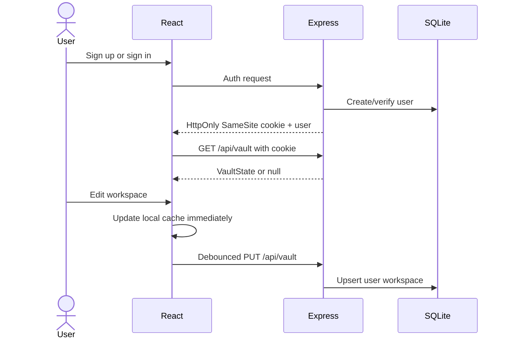
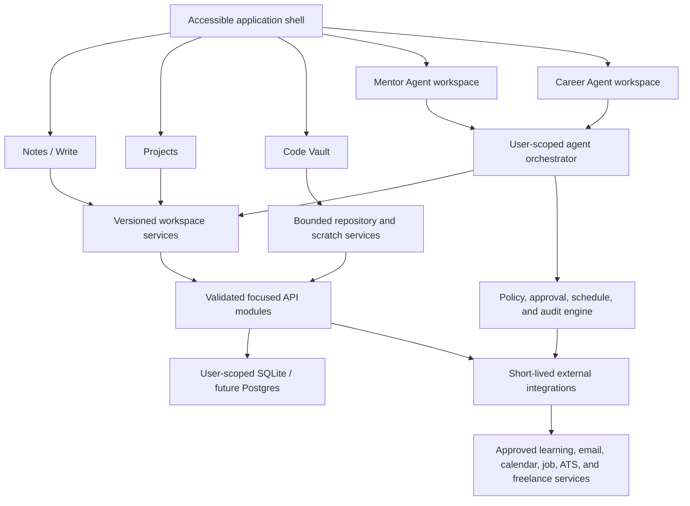
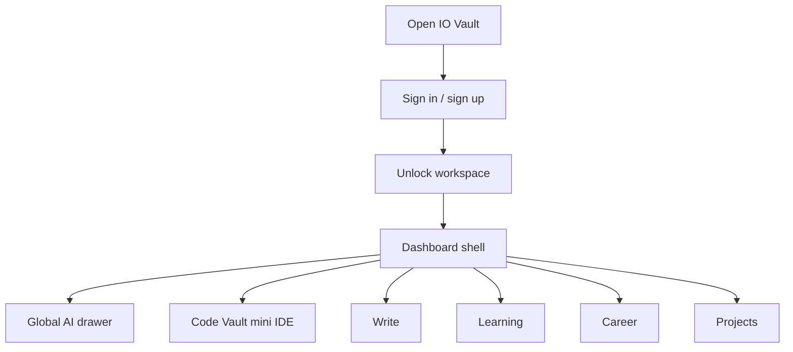
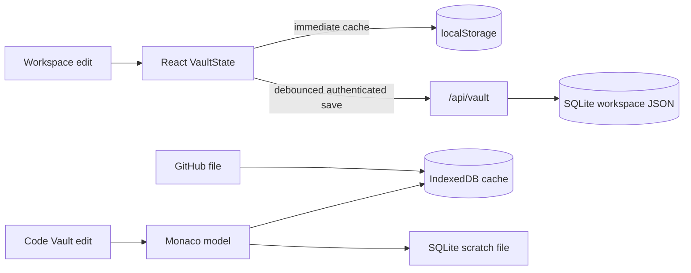
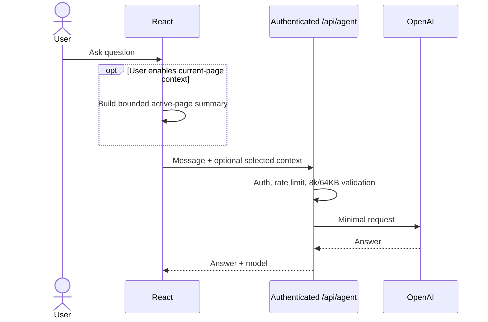

# DPL-1002 — Current Post-Monaco Testing State

| Field | Current state |
|---|---|
| Status | Deployed for testing |
| Date | 2026-08-13 |
| Commit | `73d45ac` baseline; current verified changes pending commit |
| Version | **1.0 — Current** |
| Environment | Repository-backed local testing state; Cloudflare-to-Hetzner production routing approved but not deployed |
| Previous state | [DPL-1001](DPL-1001-pre-monaco-state.md) |
| Next state | [DPL-1003](DPL-1003-next-testing-state.md) |

## Complete architecture

| Boundary | Current behavior |
|---|---|
| Frontend | Vite + React + TypeScript application with authenticated workspace pages |
| API | Express API for auth, vault sync, bounded AI, GitHub, scratch files, patches, and publishing |
| Authentication | JWT-backed HttpOnly SameSite cookie with CSRF protection; bearer compatibility for non-browser clients |
| Data | SQLite user/workspace/code records, versioned user-scoped `localStorage` recovery envelopes, and bounded IndexedDB Code Vault cache |
| Code Vault | Monaco, scratch and repository files, selected context, structured patch review/undo, and draft PR publication |
| Write | Structured hierarchy with direct drag reordering, advanced typed collections, record-based Relation pickers, guided Formula functions, themed wide-table navigation, embedded Page cells, explicit column editing/sorting, keyboard traversal, normalized external paste, dismissible linked-page overlays, compact glass creation controls, recovery, rich editing, and explicit AI context |
| Projects | Shared card/full-page Rich Text and Markdown editing, quiet theme-aware card controls, focused typed-table property workflows, foreground graph menus, persisted descriptions, bounded cloud payloads, ordered saves, truthful local-only states, protected sign-out, and reload-safe user-scoped recovery |
| Settings | Persisted Theme Mode with tinted color tuning, globally themed native scrollbars, subdued Dark, true-black Night, white Light, additional curated colors, live preview, and a Default control while preserving the animated visual system |
| AI | Authenticated, rate-limited requests with persistent user-scoped conversations, bounded recent chat history, explicit page context, compact context management, and content-free usage auditing |
| Agent platform | Shared Learning/Career Agent Workspace with durable user turns, left-side conversation layout, one-button Realtime voice, semantic turn detection, interruption, bounded ephemeral sessions, Responses API orchestration, leased runs, approvals, and encrypted Google connector storage |

Current runtime detail is consolidated below; Code Vault feature architecture is owned by [IMP-1002](../implementation-system/implementations/IMP-1002-code-vault.md).

## Version 1.0 release manifest

### Product implementations

| Implementation | Included Version 1.0 scope | State |
|---|---|---|
| [IMP-1001 — Write](../implementation-system/implementations/IMP-1001-write.md) | Hierarchical pages, rich editing, advanced typed collections, embedded Page cells, Formula and Relation contracts, explicit column editing/sorting, keyboard traversal, dismissible linked-page overlays, templates, archive recovery, and explicit assistant context | Implemented v1 |
| [IMP-1002 — Code Vault](../implementation-system/implementations/IMP-1002-code-vault.md) | Monaco editing, scratch files, reusable snippets, selected-file AI context, reviewed patches, undo, and GitHub draft-pull-request publishing | Implemented v1 |
| [IMP-1003 — Projects](../implementation-system/implementations/IMP-1003-projects.md) | Project cards, shared rich/Markdown views, contained full pages, typed tables, graph workspaces, explicit AI context, and fail-safe local/cloud persistence boundaries | Implemented and verified within repository gates |
| [IMP-1004 — Agent M · Mentor](../implementation-system/implementations/IMP-1004-learning-mentor.md) | Migrated Mentor profile, continuously glowing text workspace, explicit one-button Realtime conversation, durable user turns/tasks/runs, internal learning records, approval controls, activity, and encrypted Google Calendar adapter | Partial; live voice acceptance, full onboarding, teaching/assessment cycle, notifications, resource intake, and external Calendar verification remain in DPL-1003 |
| [IMP-1005 — Agent C · Career](../implementation-system/implementations/IMP-1005-career.md) | Migrated career profile, continuously glowing text workspace, explicit one-button Realtime conversation, durable user turns/tasks/runs, career records, Review mode, activity, and encrypted Gmail/Calendar adapter | Partial; live voice acceptance, resume parsing, confirmed-claim workflow, source/inbox adapters, full pipeline, and external Google verification remain in DPL-1003 |
| [IMP-1006 — Settings](../implementation-system/implementations/IMP-1006-settings.md) | Theme Mode with persisted tinted, Night, and Light contracts, shade/glow/depth controls, global native-scrollbar styling, presets, live preview, and default restoration | Implemented v1 |

### Verified reviews and corrections

| Record | Included Version 1.0 result | State |
|---|---|---|
| [FTR-1001 — Write manual review](../feature-review-system/reviews/FTR-1001-write-manual-review.md) | Nested rows, page deletion and recovery, collapsible sections, expanded formatting, linked Page columns, drag/keyboard organization, rename, and archive restoration | 8/8 verified |
| [FTR-1002 — Write actions review](../feature-review-system/reviews/FTR-1002-write-actions-review.md) | Foreground page menus, persisted icons, multi-format imports, trigger anchoring, stable page selection, and explicit template add-or-replace choices | 6/6 verified |
| [FTR-1003 — Write table column menu review](../feature-review-system/reviews/FTR-1003-write-table-column-menu-review.md) | Target-specific column and row menus, contextual subrow controls, persisted row highlighting, and confirmed destructive actions | 7/7 verified |
| [FTR-1004 — Write table follow-up review](../feature-review-system/reviews/FTR-1004-write-table-follow-up-review.md) | Linked-page overlays, consolidated foreground row actions, persisted column sizing, expanded icons/imports, individual status options, and compact filters | 11/11 verified |
| [FTR-1005 — Write plus menu review](../feature-review-system/reviews/FTR-1005-write-plus-menu-review.md) | Functional `+` formatting menu, toolbar-area hover activation, embedded-page availability, and foreground anchoring | Partial — 3/4 verified; advanced insertion blocks remain open |
| [FTR-1006 — Write toolbar and table review](../feature-review-system/reviews/FTR-1006-write-toolbar-and-table-review.md) | Hover-bound toolbar, normalized external paste, table keyboard behavior, dismissible sticky linked-page controls, embedded Page cells, guided Formula configuration, explicit column actions, and advanced property types | Verified — 14/14 |
| [FTR-1007 - Write table and navigation review](../feature-review-system/reviews/FTR-1007-write-table-and-navigation-review.md) | Themed wide-table navigation, stable record-based Relation behavior, guided Formula functions, direct explorer drag reordering, and compact glass creation controls | Verified — 7/7 |
| [FTR-1008 - Projects page review](../feature-review-system/reviews/FTR-1008-projects-page-review.md) | Front-card mode and deletion menus, persisted direct drag ordering, separately saved full-page workspaces, larger editable node canvases with corner actions and independent Mindmap node pages, and functional status filters | Verified — 11/11 |
| [FTR-1009 - Projects follow-up review](../feature-review-system/reviews/FTR-1009-projects-follow-up-review.md) | Outside-click page dismissal, explicit project context, live node movement, bounded resizing, position-aware card ordering, sorting, and templates | Verified — 6/6 |
| [FTR-1010 - Global AI chat review](../feature-review-system/reviews/FTR-1010-global-ai-chat-review.md) | Persistent scrollable conversations, history switching, bottom arrow composer, removed model labeling, and explicit multi-page context management | Verified — 5/5 |
| [FTR-1011 - Agent conversation and voice review](../feature-review-system/reviews/FTR-1011-agent-conversation-and-voice-review.md) | Complete durable transcripts, warmer bounded tone, responsive left-side conversation, cloud-save status, and cancellation-safe voice controls | Verified — 5/5 |
| [FTR-1012 - Projects content and layout review](../feature-review-system/reviews/FTR-1012-projects-content-and-layout-review.md) | Contained project scrolling, shared full-page/card content, rendered Markdown mini views, compact table controls, and persisted graph descriptions | Verified — 5/5 |
| [FTR-1013 - Projects editing and table review](../feature-review-system/reviews/FTR-1013-projects-editing-and-table-review.md) | Direct shared-document card editing, borderless theme-aware card controls, globally themed native scrolling, minimal typed-table menus with safe property maintenance, and viewport-aware foreground graph menus | Verified — 5/5 |
| [SEC-1.0](../audit-system/SEC-1.0-security-baseline.md) | Authenticated AI access, bounded explicit context, HttpOnly cookie sessions, and fail-closed production JWT configuration through DBG-1002–1005 | Four verified; four security findings remain open |
| [SYS-1.0](../audit-system/SYS-1.0-system-baseline.md) | Responsive behavior, typed tables, bounded workspace payloads, ordered client saves, and user-scoped recovery through DBG-1001, DBG-1007/1008 safeguards, and DBG-1017 | DBG-1007/1008 remain open for normalization and server-side conflict control |

## Verification and readiness

| Gate | Result |
|---|---|
| Tests | Realtime UI/lifecycle tests passed 9/9 and API tests passed 12/12 on 2026-08-14. The current full suite reached 106/109; the three agent-runtime cases pass 4/4 in isolation and remain non-hermetic when they share queued SQLite state with other files |
| Production build | `npm run build`: TypeScript and Vite production build passed on 2026-08-14 |
| Browser acceptance | Earlier signed-in Projects and Mentor acceptance remains recorded; current visual appearance, pointer feel, theme stacking, oversized, quota, reload, multi-tab, and screen-reader scenarios were unavailable for this run |
| Database | SQLite auto-initializes dedicated agent profiles, conversations, messages, tasks, runs, events, approvals, connector accounts/actions, and domain records; whole-workspace JSON remains for unrelated general workspace data |
| Environment/secrets | Production fails closed for missing or weak JWT secrets and local environment files cannot override deployment-provided production mode or secret; managed rotation and remaining provider readiness stay operational requirements |
| Monitoring | Application-level production monitoring is not established |
| Rollback | Git commit provides source rollback; database rollback procedure is not validated |

Open findings are acceptable for the documented local testing state, not evidence of production readiness.

## Runtime ownership

| Data | Durable authority | Browser copy |
|---|---|---|
| General workspace, Write, snippets, notes | SQLite `workspaces.data` | React and `localStorage` cache |
| Scratch files | User-scoped SQLite code tables | Monaco and bounded IndexedDB |
| GitHub files | GitHub repository | Monaco and bounded IndexedDB |
| Patch sets/publications | SQLite; published output in GitHub | Active review state |
| AI usage | Content-free SQLite metadata | None |
| Learning/Career agents | User-scoped SQLite agent and domain tables; provider tokens encrypted at rest | Active React view only; migrated legacy content is cleared from the workspace cache |

| API group | Routes | Responsibility |
|---|---|---|
| Auth | `/api/auth/signup`, `/login`, `/logout`, `/me` | Cookie identity; CSRF on unsafe cookie requests |
| Vault | `GET/PUT /api/vault` | Load/save the user’s `VaultState` |
| General AI | `POST /api/agent` | Authenticated, rate-limited, context-minimized assistant |
| Learning/Career agents | `/api/agents/*`, `/api/agent-runs/*`, `/api/approvals/*` | Durable conversations, tasks, runs, events, records, policies, cancellation, and review-first execution |
| Connectors and voice | `/api/connectors/*`, `/api/voice/*`, `/api/agents/:agent/realtime/*` | Encrypted Google OAuth lifecycle, approved Calendar/Gmail actions, legacy bounded audio endpoints, ephemeral Realtime sessions, and user-turn persistence |
| Code Vault | `/api/code/github/*`, `/scratch/*`, `/assist/stream`, `/publish` | Repository, scratch, patch, and PR workflow |

## Architecture diagrams

### Runtime topology



### Historical implementation-control topology

This superseded topology records the planning controls used before the Deployment Ledger became the project authority.



### Deployment lifecycle



### Authentication and workspace synchronization



### Target service boundaries



### Product navigation



### Persistence flow



### General assistant request



## Security, configuration, and production path

- Browser sessions are HttpOnly, SameSite=Lax, and `Secure` in production; unsafe cookie requests require `X-IOVault-CSRF: 1`.
- Auth responses do not expose JWTs; legacy browser tokens are removed. Bearer auth remains for non-browser clients.
- General AI allows 8,000-character messages and 64 KB selected context, ignores full-vault legacy context, applies a 30-second provider timeout, and records content-free usage metadata.
- `OPENAI_API_KEY` enables AI; `OPENAI_AGENT_MODEL` selects the agent model; `CONNECTOR_ENCRYPTION_KEY` is required for production connector encryption; Google OAuth requires `GOOGLE_CLIENT_ID`, `GOOGLE_CLIENT_SECRET`, and the configured callback. `JWT_SECRET` remains required for secure production. Restart after environment changes.
- Agent V1 is review-first. External Calendar events and Gmail drafts require explicit approval; no generic send-email, universal application submission, CAPTCHA bypass, password automation, purchase, enrollment, or unsupported marketplace action is exposed.
- Production readiness requires fail-closed secrets, persistent route quotas, optimistic workspace versions, selective normalization, a shared datastore before multiple API instances, monitoring, and a validated database rollback procedure.
- Narrow screens preserve the desktop workspace and use horizontal scrolling rather than silently changing the information architecture.

## Approved production routing

The Version 1.0 production path keeps the existing Node, Express, SQLite, and durable-agent architecture on the Hetzner VPS while Cloudflare provides free DNS and reverse-proxy routing for `app.akiiro.com`. This is an approved deployment plan, not evidence that the public environment is active.

```text
app.akiiro.com
  → Cloudflare DNS and HTTPS proxy
  → Hetzner VPS
      → Nginx or Caddy
          → Vite production assets
          → Express API on 127.0.0.1:8787
              → persistent SQLite
              → durable agent worker
```

| Component | Planned responsibility | Required configuration |
|---|---|---|
| Cloudflare | Free proxied `A` record for `app.akiiro.com`, edge HTTPS, DNS, and basic traffic protection | Point `app` to the Hetzner IPv4 address, enable the proxy, and use `Full (strict)` TLS |
| Hetzner VPS | Run the complete application and retain server-side data | Persistent Node service, firewall, backups, monitoring, and durable storage |
| Nginx or Caddy | Serve `dist/`, route `/api/*`, preserve React navigation, and support SSE | Proxy API traffic to port 8787 and disable buffering for agent event streams |
| Express and worker | Authentication, vault storage, AI orchestration, approvals, connectors, and background work | Run as a systemd or PM2 service rather than a development process |
| SQLite | Durable application and agent authority | Store `DATABASE_FILE` outside the release directory and back it up |
| Google OAuth | Return connector authorization to the public application | Register `https://app.akiiro.com/api/connectors/google/callback` exactly |

### Deployment checklist

- [ ] Create the proxied Cloudflare `app` DNS record targeting the Hetzner VPS.
- [ ] Install an origin certificate and set Cloudflare TLS to `Full (strict)`.
- [ ] Build the Vite application and serve `dist/` through Nginx or Caddy.
- [ ] Run Express and the agent worker as a persistent service.
- [ ] Route `/api/*` to `127.0.0.1:8787` and disable SSE buffering.
- [ ] Configure `APP_ORIGIN=https://app.akiiro.com` and the production Google callback.
- [ ] Configure production JWT, OpenAI, connector-encryption, and Google secrets outside Git.
- [ ] Place SQLite on persistent storage and verify backup and restore procedures.
- [ ] Verify authentication, CSRF, vault persistence, agent recovery, approvals, and connector revocation through the public origin.

External credentials and live-provider acceptance remain tracked in [EDEP-1001](../implementation-system/implementations/EDEP/EDEP-1001.md) and [EDEP-1002](../implementation-system/implementations/EDEP/EDEP-1002.md). Production is not complete until those records and the applicable DPL-1003 gates are satisfied.
