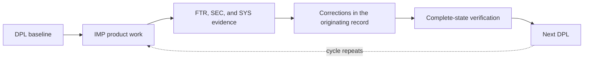

# Deployment Ledger

DPL is IO Vault’s single chronological ledger. A deployment is a complete architecture released for testing; a Version is the intentionally assigned product identity.

## Chronology

| Date | State/work | Result | Flows into |
|---|---|---|---|
| 2026-07-10 | [DPL-1001](DPL-1001-pre-monaco-state.md) | Pre-Monaco baseline at `1ca6534` | IMP-1001–1005 |
| 2026-07-15 | IMP-1002.1 | Monaco mini IDE and reviewed GitHub patch workflow | DPL-1002 |
| 2026-07-19–21 | SEC DBG-1002–1004 | AI authentication/privacy and browser sessions verified | DPL-1002 |
| 2026-07-22 | IMP-1001.1 | Structured Write pages, collections, migration, explicit AI context | DPL-1002 |
| 2026-07-23 | SYS DBG-1017 | Typed table columns verified | DPL-1002 |
| 2026-07-24–25 | FTR-1001/1002 | Manual Write findings corrected and verified | DPL-1002 |
| 2026-07-25 | [DPL-1002](DPL-1002-current-testing-state.md) | Post-Monaco testing state established at `73d45ac`; Version 1.0 | Active testing state |
| 2026-07-26 | [FTR-1003](../feature-review-system/reviews/FTR-1003-write-table-column-menu-review.md) | Write table menus, contextual subrow controls, persisted highlighting, and confirmed deletion verified with 46 tests and the production build | DPL-1002 active state |
| 2026-07-27–28 | [FTR-1004](../feature-review-system/reviews/FTR-1004-write-table-follow-up-review.md) / [FTR-1005](../feature-review-system/reviews/FTR-1005-write-plus-menu-review.md) | Table follow-up completed with linked-page overlays, foreground row controls, persisted resizing, expanded icons/imports, individual status options, and compact filters; note insertion remains partial | DPL-1002 active state; remaining FTR-1005 scope flows to DPL-1003 |
| 2026-07-29 | [FTR-1006](../feature-review-system/reviews/FTR-1006-write-toolbar-and-table-review.md) | Corrected toolbar activation, external paste normalization, linked-page dismissal, embedded Page ownership, table behavior, and advanced property workflows completed | DPL-1002 current testing state |
| 2026-07-29 | [IMP-1006](../implementation-system/implementations/IMP-1006-settings.md) | Settings page and persisted Theme Mode implemented without replacing IO Vault’s animated visual system | DPL-1002 current testing state |
| 2026-07-30 | [FTR-1007](../feature-review-system/reviews/FTR-1007-write-table-and-navigation-review.md) | Themed table navigation, stable record relations, guided Formula functions, direct explorer reordering, and compact creation controls verified with 50 tests, the production build, and signed-in browser acceptance | DPL-1002 current testing state |
| — | [DPL-1003](DPL-1003-next-testing-state.md) | Planned next complete testing state | Not deployed |

Open SEC/SYS findings are accepted testing limitations, not production-readiness evidence.

## Version register

| Version | DPL | Status | Date | Meaning |
|---|---|---|---|---|
| 1.0 | [DPL-1002](DPL-1002-current-testing-state.md) | Current | 2026-07-28 | Current product identity in the documented testing state |

A later testing DPL does not automatically change the Version. The package manifest’s `0.1.0` is build metadata, not the product Version authority.

## Authority and routing

| Record | Responsibility |
|---|---|
| DPL | Historical, current, or planned complete testing state |
| IMP | Page-level product outcomes flowing toward the next DPL |
| FTR | Manual feature findings and their corrections |
| SEC/SYS | Versioned security and system audit lanes |
| DBG | Individual evidence, correction, status, and verification inside one audit lane |

Only DPL and IMP describe future outcomes. Documentation-only maintenance receives no work code.

## Historical aliases

Former identifiers remain here only for searchability; Git history preserves their original files.

| Former authority/code | Current owner |
|---|---|
| `work-system/ledger.md`, `implementation-log.md`, `deployment-system/` | Deployment Ledger |
| `debug-system/` and `ADT-1001` | SEC-1.0 or SYS-1.0 |
| `DOC-*` | Retired; no code for documentation maintenance |
| `DBG-IMP-*` | Owning DBG |
| `FTR-IMP-*` | Owning FTR |
| Former `DBG-1015` responsive shell | DBG-1001 |
| Former DBG-1001 through DBG-1014 | Current DBG-1002 through DBG-1015, in order |
| Former DBG-1016 | DBG-1016 |
| `ADT-1001` / `DBG-IMP-1004` typed columns | DBG-1017 |
| Former IMP-1003 Write | IMP-1001 |
| Former IMP-1002 Code Vault | IMP-1002 |
| Former IMP-1004 Projects | IMP-1003 |
| Former IMP-1005 Learning | IMP-1004 |
| Legacy IMP-1006 Career | IMP-1005; retired Career alias predates the current IMP-1006 Settings assignment |

Former DBG-IMP-1001/1002/1003 map to DBG-1002/1003/1004; DBG-IMP-1005 maps to DBG-1007/1008; DBG-IMP-1006 maps to DBG-1011; DBG-IMP-1011 maps to DBG-1001. Former FTR-IMP-1001, 1002, and 1004 map to FTR-1001; FTR-IMP-1003 maps to FTR-1002. Historical aliases remain explicitly labeled so they cannot be mistaken for current work codes.
