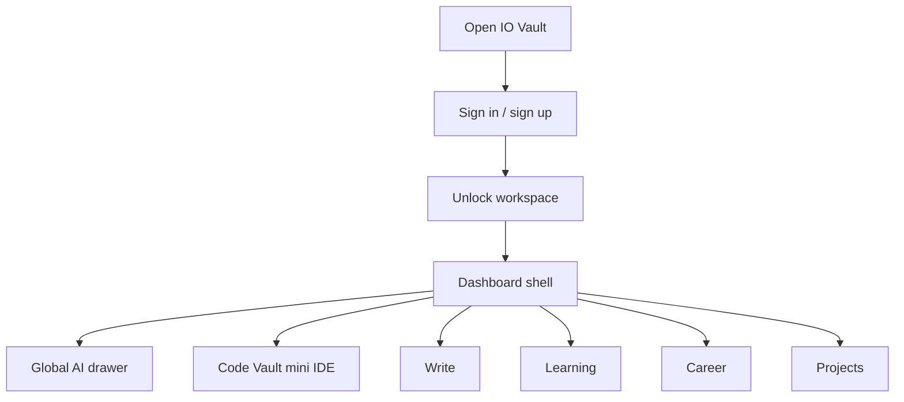
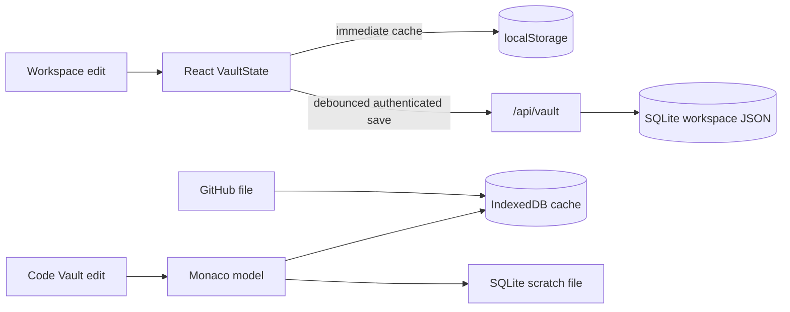
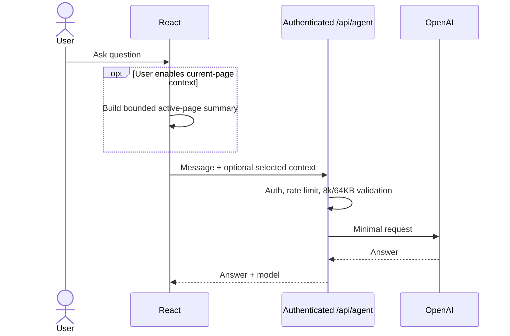
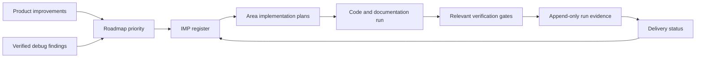
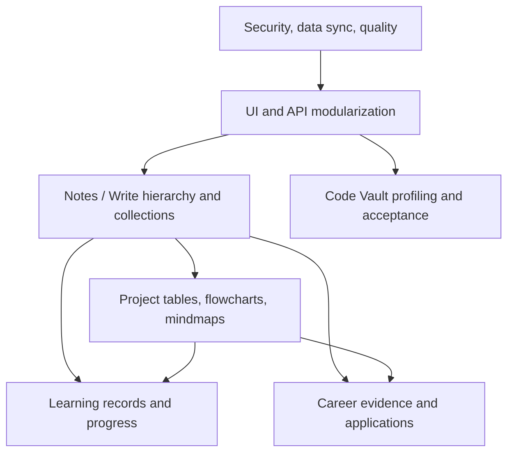

# Current Product Diagrams

These diagrams summarize navigation and data flow. Detailed Code Vault diagrams live in [code-vault-architecture.md](code-vault-architecture.md).

> **Legacy reference diagrams — preserved unchanged.** The original navigation, persistence, and AI diagrams below remain as a historical product baseline. New implementation-system diagrams are added after them.

## Product navigation

The server establishes an HttpOnly SameSite cookie at login; unsafe browser requests also carry `X-IOVault-CSRF: 1`.

## Persistence flow

## General AI request

## Responsive policy

Desktop structure is preserved on narrow screens. A minimum-width workspace scrolls horizontally instead of stacking panels or converting the sidebar into a top rail.

## Current implementation-system map

## Current page-improvement map

Detailed current maps live under [implementation-system/graphs](implementation-system/graphs/implementation-map.md). The legacy Mermaid blocks above are intentionally retained rather than rewritten.

Notes pages and collections still follow the preserved workspace persistence flow above: changes update `VaultState`, cache locally, and sync through `/api/vault`. No legacy Mermaid block was changed for IMP-1003.
