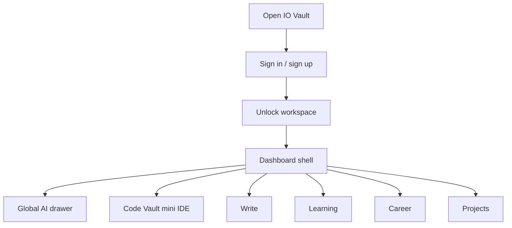
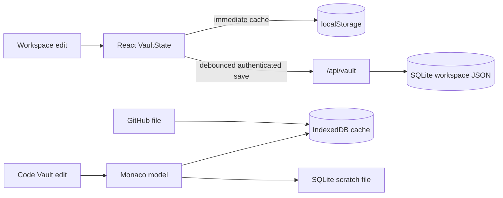
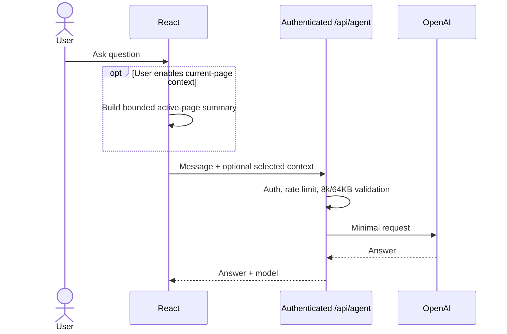

# Current Product Diagrams

These diagrams summarize navigation and data flow. Detailed Code Vault diagrams live in [code-vault-architecture.md](code-vault-architecture.md).

## Product navigation

## Persistence flow

## General AI request

## Responsive policy

Desktop structure is preserved on narrow screens. A minimum-width workspace scrolls horizontally instead of stacking panels or converting the sidebar into a top rail.
