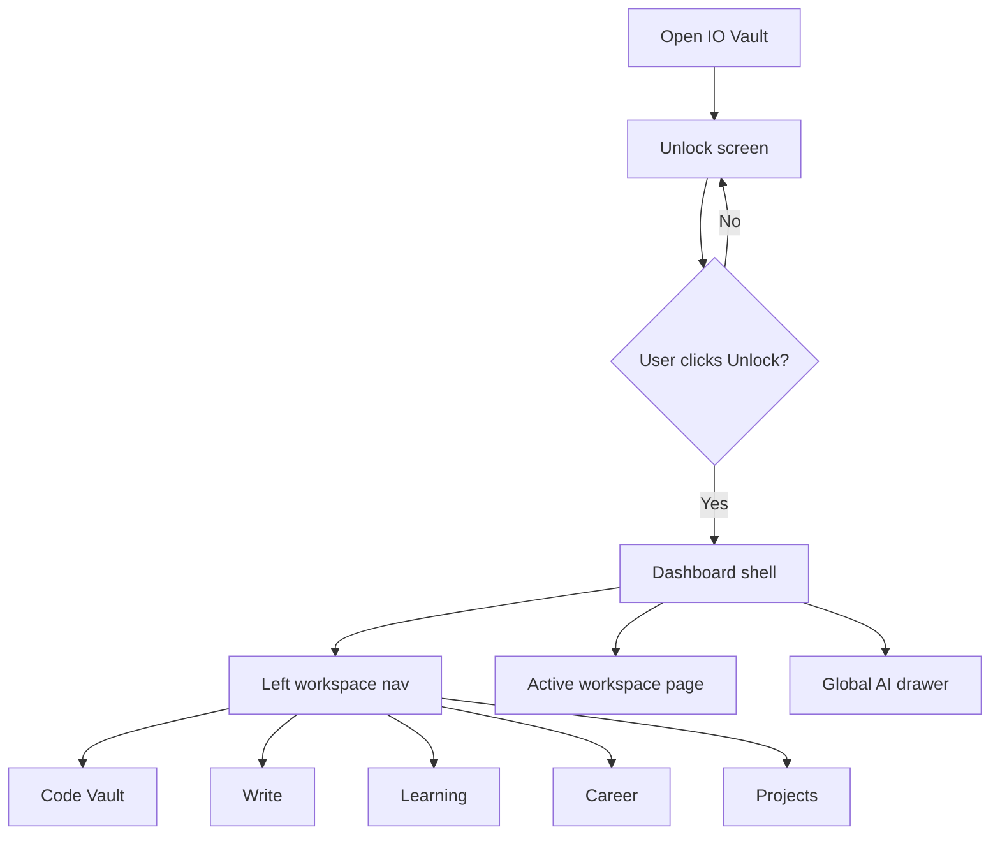
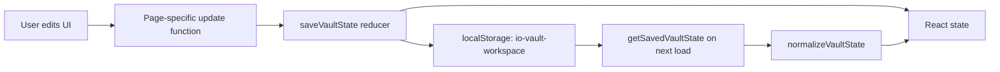
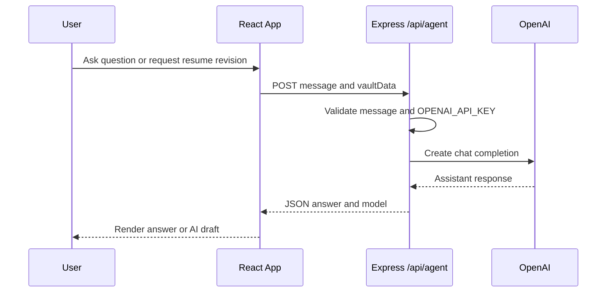
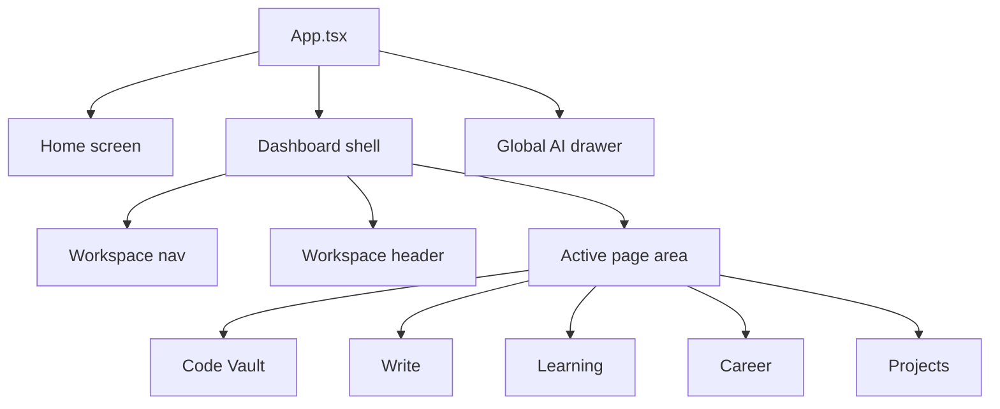
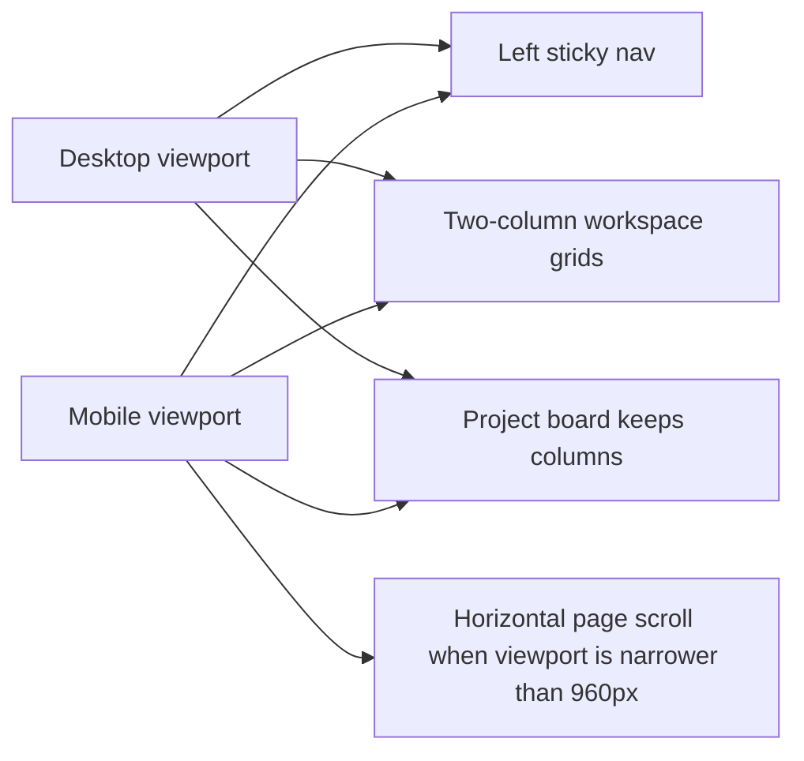
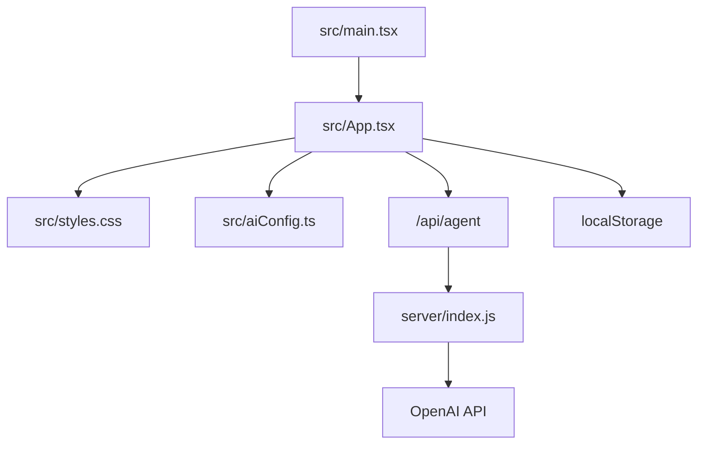

# Diagrams

These diagrams describe the current IO Vault implementation. Update them when routes, state ownership, storage, API contracts, or layout behavior change.

## App Flow

## Frontend State And Persistence

## AI Request Flow

## Component Layout

## Responsive Layout Policy

## File Responsibility Map

