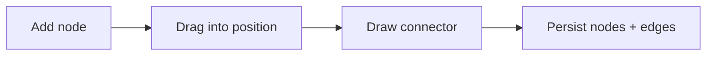

# Project Flowchart / Node Map

**Status:** planned after the data table. This is the manual graph: users position nodes and draw each connector.

## v1 decisions

| Area | Direction |
|---|---|
| Entry | Project action opens the shared overlay in `flowchart` mode |
| Nodes | ID, x/y position, label, optional color |
| Edges | ID, source, target, optional label; directed by default |
| Editing | Add, drag, connect, rename, delete, zoom, fit |
| Persistence | `flowchart?: { nodes, edges }` on `ProjectBlock`; save positions on drag end |

Use `@xyflow/react` unless dependency review rejects it; it already solves pan, zoom, dragging, and connectable handles. A custom SVG implementation avoids a dependency but adds substantial input, hit-testing, and geometry code.

## Acceptance

- Node and edge edits survive reload and account sync.
- Deleting a node removes its edges.
- Position writes are debounced or committed on drag end.
- Keyboard deletion, focus, zoom, and narrow-screen use are tested.
