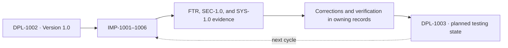

# IO Vault Implementation System

IMP owns page-level product outcomes moving the current testing state toward [DPL-1003](../deployment-ledger/DPL-1003-next-testing-state.md). Defects and corrections remain in FTR, SEC, or SYS.

## Register

| Parent | Page | Current state | Next numbered outcome |
|---|---|---|---|
| [IMP-1001](implementations/IMP-1001-write.md) | Write | Workspace and hierarchy implemented; FTR-1001–1004 and FTR-1006–1007 verified; FTR-1005 partial | `IMP-1001.3` cross-area links and the remaining `IMP-1001.1.2.1` insertion catalog |
| [IMP-1002](implementations/IMP-1002-code-vault.md) | Code Vault | `IMP-1002.1` mini IDE implemented | `IMP-1002.2` repository workflow refinement |
| [IMP-1003](implementations/IMP-1003-projects.md) | Projects | `IMP-1003.1-1003.6` and [FTR-1008](../feature-review-system/reviews/FTR-1008-projects-page-review.md), [FTR-1009](../feature-review-system/reviews/FTR-1009-projects-follow-up-review.md), and [FTR-1012](../feature-review-system/reviews/FTR-1012-projects-content-and-layout-review.md) implemented and verified | Future Projects work remains unassigned until planned |
| [IMP-1004](implementations/IMP-1004-learning-mentor.md) | Learning / Mentor | Legacy migration, verified conversation/voice workspace, durable runs, approval controls, history, and Google Calendar adapter implemented; teaching workflow remains partial | Complete `IMP-1004.2.2–1004.2.4`, notifications, resource intake, and externally verify `IMP-1004.2.6.1` |
| [IMP-1005](implementations/IMP-1005-career.md) | Career | Legacy migration, verified conversation/voice workspace, durable runs, Review mode, career records, and Google adapter implemented; career workflow remains partial | Complete `IMP-1005.1.2`, `1005.2.2–1005.2.3`, source/inbox adapters, and externally verify `1005.2.5.2/1005.2.6` |
| [IMP-1006](implementations/IMP-1006-settings.md) | Settings | `IMP-1006.1` Theme Mode implemented | Future settings remain unassigned until planned |

External requirements are organized in one EDEP register folder: [EDEP-1001](implementations/EDEP/EDEP-1001.md) tracks Mentor dependencies and links to IMP-1004, while [EDEP-1002](implementations/EDEP/EDEP-1002.md) tracks Career dependencies and links to IMP-1005.

Each page owns its hierarchy: `IMP-1001.*` never describes Code Vault, and `IMP-1002.*` never describes another page. A rollout uses `.1`; a distinct capability inside that rollout uses `.1.1`; a separately scoped nested capability may use `.1.1.1`. Rollout rows such as `.1` and `.2` remain unindented and use no arrow. Every deeper numeric segment adds one visible indentation level and a `↳` marker. When a parent outcome is decomposed, matched numbered markers identify the parent phrase owned by each deeper row without relying on color.

## Lifecycle

## Corrective dependencies

| Implementation | Authoritative dependencies |
|---|---|
| IMP-1001 Write | SYS DBG-1007/1008 persistence and sync; SEC DBG-1011 rich-text safety |
| IMP-1002 Code Vault | SYS DBG-1015 editor-state pressure |
| IMP-1003 Projects | SYS persistence/sync; SEC rich-text and dependency safety |
| IMP-1004 Mentor | SEC validation/limits; SYS persistence and modular boundaries |
| IMP-1005 Career | SEC credentials/validation; SYS persistence and modular boundaries |
| IMP-1006 Settings | SYS workspace persistence and shared UI-system boundaries |

See [SEC-1.0](../audit-system/SEC-1.0-security-baseline.md) and [SYS-1.0](../audit-system/SYS-1.0-system-baseline.md). IMP files link to findings but never duplicate their status.

## Verification

| Gate | Command or evidence | Current availability |
|---|---|---|
| TypeScript + production bundle | `npm run build` | Available |
| Unit, React, and API behavior | `npm test` | Available |
| Full local product | `npm run dev` | Manual |
| Dependency review | `npm audit` | On demand |
| Browser E2E, lint, health, migrations, performance budget | No durable repository command | Planned |

| Date | Work | Evidence |
|---|---|---|
| 2026-08-01 | FTR-1011 · IMP-1004.2.1/1004.2.5.3.1 · IMP-1005.2.1/1005.2.5.3.1 | 66 tests, production build, complete-transcript and duplicate-event coverage, and signed-in conversation/cloud/voice-control acceptance |
| 2026-08-01 | FTR-1012 · IMP-1003.1.1/1003.1.4/1003.2.2/1003.3.4/1003.4.5 | 64 tests, production build, focused graph/table coverage, contained-overlay browser acceptance, and shared Markdown card rendering |
| 2026-07-31 | IMP-1004.1/1004.2 · IMP-1005.1/1005.2 | 63 tests, production build, durable-runtime, connector idempotency, and exact-approval coverage, signed-in live Career task, Learning/Career UI acceptance, persistent conversation recovery, and corrected 390×844 agent layout |
| 2026-07-29 | IMP-1006.1 · Settings Theme Mode | 50 tests, production build, signed-in live/persist/restore acceptance, retained `rotateGlow` motion, and zero console errors |
| 2026-07-30 | IMP-1003.2-1003.5 · FTR-1008 | 56 tests, production build, signed-in table/flowchart/mindmap/filter/persistence acceptance, and zero console errors |
| 2026-07-29 | FTR-1006 · IMP-1001.1.2.1/1001.1.3/1001.1.3.1 | 50 tests, production build, corrected signed-in acceptance, guided Formula setup, and zero console errors |
| 2026-07-28 | FTR-1004 · IMP-1001.1.3/1001.2.2/1001.2.4 | 48 tests, production build, signed-in control rendering, and clean browser console |
| 2026-07-27 | FTR-1005 · IMP-1001.1.2.1 | 46 tests, production build, linked-page coverage, and signed-in menu/toolbar acceptance |
| 2026-07-26 | FTR-1003 · IMP-1001.1.3 | 46 tests, production build, authenticated persistence, and signed-in table-menu acceptance |
| 2026-07-25 | FTR-1001 · IMP-1001.1.2/1.1.3/1.2.1–1.2.3 | 44 tests, production build, signed-in formatting/hierarchy/keyboard acceptance |
| 2026-07-24 | FTR-1002 · IMP-1001.1.4/1.2.2/1.2.4 | 38 tests, production build, signed-in menu/template acceptance |
| 2026-07-24 | IMP-1004/1005 | Agent roles, policies, feasibility, phases, limits, and acceptance documented |
| 2026-07-23 | DBG-1017 · IMP-1001 | 30 tests, build, signed-in typed-column save/reload acceptance |
| 2026-07-22 | IMP-1001 | 27 tests, build, signed-in smoke check with zero console errors |

The deployment ledger owns complete-state evidence. Never mark a gate complete merely because its command exists.

## Record format

Every new implementation entry records its code, state, current evidence, target behavior, numbered child outcomes, measurable acceptance, explicit limits, SEC/SYS dependencies, and dated verification. Completed repository runs end with an evidence-based handoff and past-tense commit sentence.
