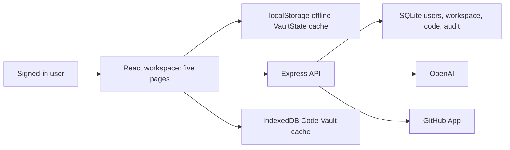

# Current Product Boundaries

The five primary workspaces are Code Vault, Write, Learning, Career, and Projects. Most page state still travels inside one `VaultState` JSON document; Code Vault repository bodies and scratch infrastructure use dedicated storage.

