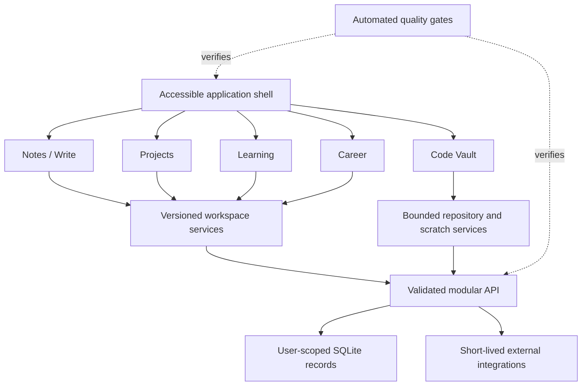

# Target Product Boundaries

The target keeps each page independently testable, shares structured content primitives deliberately, and avoids turning every feature into a larger workspace JSON blob.

