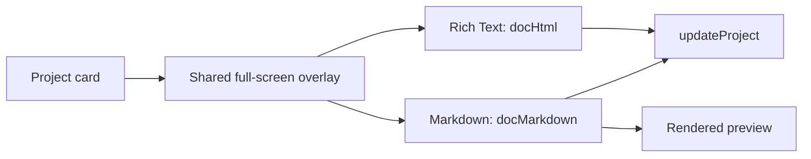
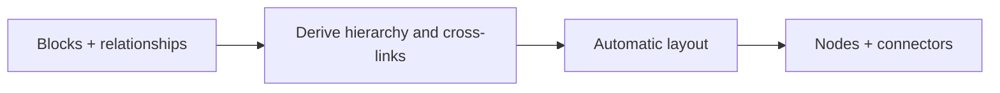

# IMP-1004 — Projects

**State:** Partial · **Priority:** P2

| Capability | State |
|---|---|
| Project cards and status | Available |
| Rich-text / Markdown full-page editor | Implemented |
| Typed project table | Planned next |
| Manual flowchart | Planned after table |
| Automatic object mindmap | Planned after flowchart |

## Steps

1. Add versioned typed table data with safe migration and cleanup on column deletion.
2. Reuse one project overlay contract for table, flowchart, and mindmap modes.
3. Implement manual nodes/edges and persist positions on drag completion.
4. Implement object relationships with derived edges and deterministic layout.

**Acceptance:** all project modes persist through account sync; existing projects load unchanged; keyboard and narrow-screen workflows work; graph deletion cannot leave orphaned references.

## Full-page editor — implemented

The first project-card action opens a shared full-screen overlay with independent Rich Text and Markdown documents.

| Area | Behavior |
|---|---|
| Entry | Expand action selects the project, Rich Text mode, and edit view |
| Header | Back, editable title, and project status |
| Rich Text | Uncontrolled `contentEditable` with formatting controls |
| Markdown | Full-width source editor with edit/preview toggle |
| Persistence | `docHtml` and `docMarkdown` update `ProjectBlock` and normal workspace sync |

Rich Text and Markdown stay separate to avoid lossy conversion. The uncontrolled rich editor preserves the caret; sanitization remains owned by DBG-1010.



## Typed data table — planned next

| Decision | v1 default |
|---|---|
| Column types | Text, number, date, checkbox, select |
| Cell storage | Values keyed by column ID; checkbox normalized consistently |
| Editing | Controlled inline inputs |
| Actions | Add/delete row and column; edit select options |
| Deferred | Formulas, CSV export, and spreadsheet-scale behavior |

```ts
type TableDoc = {
  columns: Array<{ id: string; name: string; type: "text" | "number" | "date" | "checkbox" | "select"; options?: string[] }>;
  rows: Array<Record<string, string>>;
};
```

Store `table?: TableDoc` on `ProjectBlock`, normalize missing data, and remove deleted column keys from every row. Existing projects must load unchanged; typed edits and row/column deletion must survive reload and account sync.

## Manual flowchart — planned

Users position nodes and explicitly draw connectors.

| Area | v1 direction |
|---|---|
| Nodes | ID, x/y position, label, optional color |
| Edges | ID, source, target, optional label; directed by default |
| Editing | Add, drag, connect, rename, delete, zoom, fit |
| Persistence | Store nodes/edges; commit positions on drag end |


Use `@xyflow/react` unless dependency review rejects it. Deleting a node must remove its edges; keyboard deletion, focus, zoom, and narrow-screen behavior require acceptance coverage.

## Object mindmap — planned

Users edit objects and relationships; the renderer derives edges and positions automatically.

| Area | v1 direction |
|---|---|
| Object | ID, title, optional parent, relation IDs, key/value fields |
| Layout | Top-down default with re-layout and fit actions |
| Rendering | React Flow plus Dagre for the first hierarchical version |
| Persistence | Store blocks and relationships; recompute positions on open |
| Validation | Prevent missing references and identify/reject parent cycles |



```ts
type MindmapDoc = {
  blocks: Array<{ id: string; title: string; parentId?: string; linkIds?: string[]; fields?: Array<{ key: string; value: string }> }>;
  rootId?: string;
};
```

Relationship changes cannot leave orphaned references. Layout should remain deterministic enough to avoid disorienting movement, and saved object data must survive reload even when positions are recomputed.

## Engineering dependencies

Workspace growth, sync conflicts, rich-text safety, and new dependency review are owned by [DBG-1006, DBG-1007, DBG-1010, and DBG-1012](../engineering-dependencies.md).
