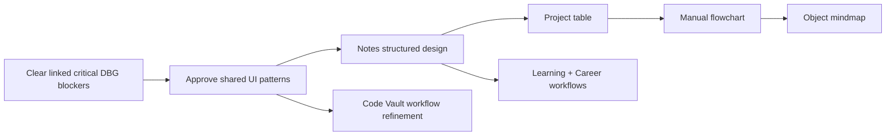

# Recommended Delivery Order

```mermaid
flowchart LR
  A["Clear linked critical DBG blockers"] --> B["Approve shared UI patterns"]
  B --> C["Notes structured design"]
  C --> D["Project table"]
  D --> E["Manual flowchart"]
  E --> F["Object mindmap"]
  C --> G["Learning + Career workflows"]
  B --> H["Code Vault workflow refinement"]
```

The debug system owns blocker completion; this graph only shows when product design can safely proceed.
