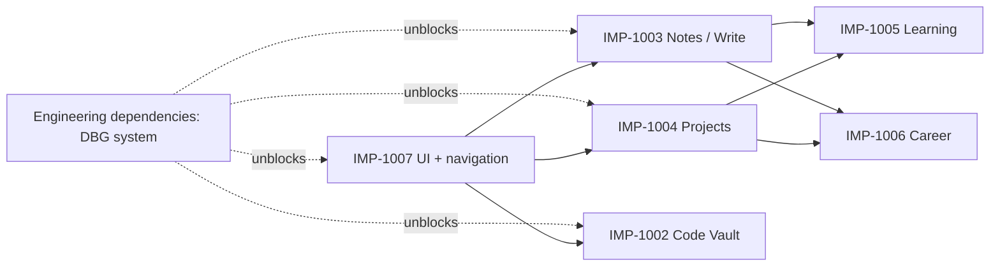

# Implementation Map

```mermaid
flowchart LR
  Engineering["Engineering dependencies: DBG system"] -. unblocks .-> UI["IMP-1007 UI + navigation"]
  Engineering -. unblocks .-> Notes["IMP-1003 Notes / Write"]
  Engineering -. unblocks .-> Projects["IMP-1004 Projects"]
  Engineering -. unblocks .-> Code["IMP-1002 Code Vault"]
  UI --> Notes
  UI --> Projects
  UI --> Code
  Notes --> Learning["IMP-1005 Learning"]
  Notes --> Career["IMP-1006 Career"]
  Projects --> Learning
  Projects --> Career
```

Dashed edges are links to engineering work owned by the [debug system](../../debug-system/README.md), not duplicate IMP workstreams.
