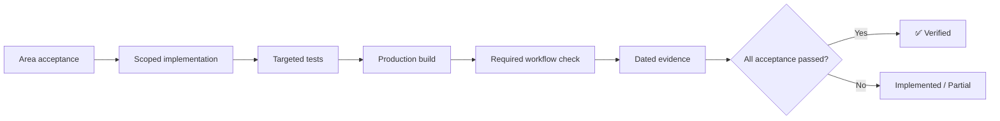

# Verification Flow

```mermaid
flowchart LR
  Plan["Area acceptance"] --> Implement["Scoped implementation"]
  Implement --> Tests["Targeted tests"]
  Tests --> Build["Production build"]
  Build --> Manual["Required workflow check"]
  Manual --> Evidence["Dated evidence"]
  Evidence --> Status{"All acceptance passed?"}
  Status -->|"Yes"| Verified["✅ Verified"]
  Status -->|"No"| Partial["Implemented / Partial"]
```

