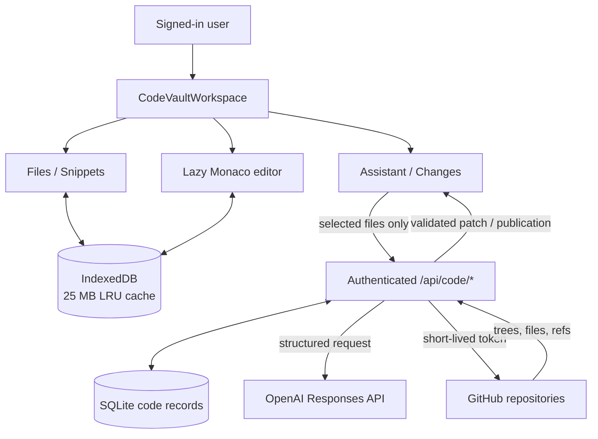

# IMP-1002 — Code Vault

**State:** Implemented v1 · **Priority:** P1 · **Next DPL:** DPL-1003

Code Vault is IO Vault’s GitHub-backed, AI-assisted mini IDE. GitHub remains authoritative for repository files; SQLite owns user records; IndexedDB provides a bounded working cache; snippets remain globally reusable.

## Numbered implementation

| Code | Outcome | Status |
|---|---|---|
| `IMP-1002.1` | Mini IDE v1 | Implemented |
| &emsp;↳ `IMP-1002.1.1` | Migrate legacy editor text to `Untitled.<language>` without losing snippets or notes | Implemented |
| &emsp;↳ `IMP-1002.1.2` | Three-pane Files/Snippets, Monaco, and Assistant/Changes workspace | Implemented |
| &emsp;↳ `IMP-1002.1.3` | Lazy-load Monaco and repository data | Implemented |
| &emsp;↳ `IMP-1002.1.4` | Open-file tabs, search, syntax highlighting, diagnostics, and dirty indicators | Implemented |
| &emsp;↳ `IMP-1002.1.5` | Create, rename, edit, delete, cache, and persist scratch files | Implemented |
| &emsp;↳ `IMP-1002.1.6` | Edit snippet filenames with extensions and infer syntax from the extension | Implemented |
| &emsp;↳ `IMP-1002.1.7` | Preserve snippets with tags, descriptions, timestamps, and optional repository provenance | Implemented |
| &emsp;↳ `IMP-1002.1.8` | Explicit selected-file AI context and opt-in task scratchpad | Implemented |
| &emsp;↳ `IMP-1002.1.9` | Stream structured explanations and proposed file operations | Implemented |
| &emsp;↳ `IMP-1002.1.10` | Patch review — **① per-file changes**, **② independent approval**, and **③ apply/undo** without automatic mutation | Implemented |
| &emsp;&emsp;↳ `IMP-1002.1.10.1` | **①** Render each proposed create, edit, rename, or delete as a separate reviewable file change | Implemented |
| &emsp;&emsp;↳ `IMP-1002.1.10.2` | **②** Accept or reject proposed file changes independently before local mutation | Implemented |
| &emsp;&emsp;↳ `IMP-1002.1.10.3` | **③** Apply only accepted changes and restore the previous file snapshot through undo | Implemented |
| &emsp;↳ `IMP-1002.1.11` | Bounded IndexedDB tree, text, edit, and search cache with clean-file LRU eviction | Implemented |
| &emsp;↳ `IMP-1002.1.12` | User-scoped SQLite scratch, session, patch, GitHub, and publication records | Implemented |
| &emsp;↳ `IMP-1002.1.13` | GitHub App repository discovery with short-lived server-side installation tokens | Implemented |
| &emsp;↳ `IMP-1002.1.14` | GitHub publication — **① base validation**, **② atomic branch/commit**, and **③ draft pull-request record** | Implemented |
| &emsp;&emsp;↳ `IMP-1002.1.14.1` | **①** Revalidate the repository base SHA before publishing approved changes | Implemented |
| &emsp;&emsp;↳ `IMP-1002.1.14.2` | **②** Build one atomic Git tree and commit on a new `iovault/*` branch | Implemented |
| &emsp;&emsp;↳ `IMP-1002.1.14.3` | **③** Open a draft pull request and retain the resulting publication record | Implemented |
| &emsp;↳ `IMP-1002.1.15` | Conservative standalone Monaco diagnostics to avoid misleading semantic errors | Implemented |
| &emsp;↳ `IMP-1002.1.16` | Reject unsafe paths, ignored/secret/binary files, files over 1 MB, and unapproved changes | Implemented |
| `IMP-1002.2` | Refined repository-change workflow | Planned |
| &emsp;↳ `IMP-1002.2.1` | Clarify repository selection, file discovery, and branch/base state | Planned |
| &emsp;↳ `IMP-1002.2.2` | Clarify assistant progress, context, assumptions, warnings, and failures | Planned |
| &emsp;↳ `IMP-1002.2.3` | Complete connect → multi-file proposal → partial rejection → draft PR acceptance | Planned |
| &emsp;↳ `IMP-1002.2.4` | Complete keyboard, narrow-screen, offline, and cache-recovery acceptance | Planned |
| &emsp;↳ `IMP-1002.2.5` | Profile realistic repository memory and render behavior with SYS DBG-1015 | Planned |

## User workflow


## Architecture



| Data | Working copy | Durable source |
|---|---|---|
| Connected repository file | Monaco + IndexedDB | GitHub |
| Unsaved repository edit | Monaco + IndexedDB | None until reviewed publication |
| Scratch file | Monaco + IndexedDB | SQLite |
| Snippet and provenance | React | `VaultState` through workspace sync |
| Task scratchpad | React | `VaultState` notes |
| Patch/publication | Review state | SQLite; published result in GitHub |
| Installation token | Server memory only | Short-lived GitHub token |

## AI and publication

```mermaid
sequenceDiagram
  actor U as User
  participant UI as Code Vault
  participant API as Express
  participant AI as OpenAI
  participant DB as SQLite
  participant GH as GitHub
  U->>UI: Check files and submit task
  UI->>API: Authenticated selected context
  API->>API: Validate count, size, and paths
  API->>AI: Task + selected files
  AI-->>API: Structured explanation + operations
  API->>API: Validate every proposed operation
  API->>DB: Save owned patch set
  API-->>UI: Stream result
  U->>UI: Accept/reject and apply/undo
  opt Publish
    UI->>API: Approved changes + patch set ID
    API->>GH: Revalidate base SHA
    alt Current
      API->>GH: Atomic tree + commit + new branch + draft PR
      API->>DB: Save publication history
    else Stale
      API-->>UI: 409 conflict; no mutation
    end
  end
```

## Limits and acceptance

- No terminal, code execution, dependency installation, live preview, force-push, existing-branch overwrite, or direct local folders.
- AI sees only checked files, up to 12 files and 300,000 characters; the scratchpad is opt-in.
- Repository browsing excludes ignored, generated, dependency, build, secret, binary, and oversized paths.
- V1 acceptance requires scratch recovery and a connected multi-file workflow with visible context, one rejected file, approved files applied, and a draft pull request.
- Monaco, React state, undo snapshots, and IndexedDB may duplicate bodies temporarily; [SYS-1.0 DBG-1015](../../audit-system/SYS-1.0-system-baseline.md#dbg-1015--monaco-and-react-state-pressure) owns profiling and correction.

## GitHub App setup

Grant Metadata read, Contents read/write, Pull requests read/write, and Actions read. Configure the App values from `.env.example`, use `http://localhost:8787/api/code/github/callback` locally, and restart `npm run dev`. Only installation metadata is stored; installation tokens are generated server-side and expire.
