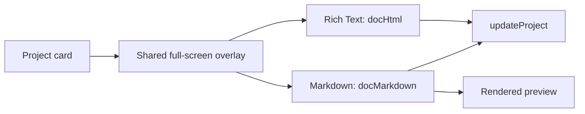

# IMP-1003 — Projects

**State:** Implemented · **Priority:** P2

## Numbered implementation

| Code | Outcome | Review evidence | Status |
|---|---|---|---|
| `IMP-1003.1` | Full-page editor | - | Implemented |
| &emsp;↳ `IMP-1003.1.1` | Shared full-screen project overlay | - | Implemented |
| &emsp;↳ `IMP-1003.1.2` | Independent rich-text and Markdown documents with preview | - | Implemented |
| &emsp;↳ `IMP-1003.1.3` | Persist title, status, `docHtml`, and `docMarkdown` | - | Implemented |
| `IMP-1003.2` | Typed table | [FTR-1008](../../feature-review-system/reviews/FTR-1008-projects-page-review.md) | Implemented and verified |
| &emsp;↳ `IMP-1003.2.1` | Versioned text, number, date, checkbox, and select columns | [FTR-1008](../../feature-review-system/reviews/FTR-1008-projects-page-review.md) | Implemented and verified |
| &emsp;↳ `IMP-1003.2.2` | Inline row/column editing, select options, deletion cleanup, and sync | [FTR-1008](../../feature-review-system/reviews/FTR-1008-projects-page-review.md) | Implemented and verified |
| `IMP-1003.3` | Flowchart | [FTR-1008](../../feature-review-system/reviews/FTR-1008-projects-page-review.md) | Implemented and verified |
| &emsp;↳ `IMP-1003.3.1` | Editable rectangular nodes, direct node-to-node arrow connections, colors, zoom, and fit | [FTR-1008](../../feature-review-system/reviews/FTR-1008-projects-page-review.md) | Implemented and verified |
| &emsp;↳ `IMP-1003.3.2` | Persist drag positions and remove orphaned edges | [FTR-1008](../../feature-review-system/reviews/FTR-1008-projects-page-review.md) | Implemented and verified |
| `IMP-1003.4` | Object mindmap | [FTR-1008](../../feature-review-system/reviews/FTR-1008-projects-page-review.md) | Implemented and verified |
| &emsp;↳ `IMP-1003.4.1` | Blank editable idea rectangles with direct node-to-node arrows and colors | [FTR-1008](../../feature-review-system/reviews/FTR-1008-projects-page-review.md) | Implemented and verified |
| &emsp;↳ `IMP-1003.4.2` | Persisted drag positioning, cycle prevention, and orphaned-reference cleanup | [FTR-1008](../../feature-review-system/reviews/FTR-1008-projects-page-review.md) | Implemented and verified |
| `IMP-1003.5` | Project portfolio controls | [FTR-1008](../../feature-review-system/reviews/FTR-1008-projects-page-review.md) | Implemented and verified |
| &emsp;↳ `IMP-1003.5.1` | Confirmed project deletion available from project and contextual actions | [FTR-1008](../../feature-review-system/reviews/FTR-1008-projects-page-review.md) | Implemented and verified |
| &emsp;↳ `IMP-1003.5.2` | Direct persisted project-card drag reordering | [FTR-1008](../../feature-review-system/reviews/FTR-1008-projects-page-review.md) | Implemented and verified |
| &emsp;↳ `IMP-1003.5.3` | Front-card project menu opening separately persisted full-page table and graph workspaces | [FTR-1008](../../feature-review-system/reviews/FTR-1008-projects-page-review.md) | Implemented and verified |
| &emsp;↳ `IMP-1003.5.4` | All, Active, In Progress, and Done project filters | [FTR-1008](../../feature-review-system/reviews/FTR-1008-projects-page-review.md) | Implemented and verified |

| Capability | State |
|---|---|
| Project cards and status | Available |
| Rich-text / Markdown full-page editor | Implemented |
| Typed project table | Implemented and verified |
| Manual flowchart | Implemented and verified |
| Visual object mindmap | Implemented and verified |
| Portfolio deletion, ordering, mode menu, and status filters | Implemented and verified |

## Delivery record

1. Added normalized mode data while preserving legacy project cards and documents.
2. Reused the project overlay for rich text, Markdown, table, flowchart, and mindmap workspaces.
3. Added persisted typed cells and draggable rectangular Flowchart and Mindmap nodes with editable text, direct node-to-node arrows, colors, relationships, and cleanup.
4. Added confirmed deletion, direct card dragging, a foreground card actions menu, and status filters.

**Acceptance:** all project modes persist through account sync; existing projects load unchanged; keyboard and narrow-screen workflows work; graph deletion cannot leave orphaned references.

**Verification:** 12 test files and 56 tests passed, the production build passed, and signed-in browser acceptance confirmed editable rectangular Flowchart/Mindmap nodes, direct two-node connections without Source/Target forms, saved Mindmap text and relationships after reload, and zero console errors on 2026-07-30.

## `IMP-1003.1` — Full-page editor

The first project-card action opens a shared full-screen overlay with independent Rich Text and Markdown documents.

| Area | Behavior |
|---|---|
| Entry | Expand action selects the project, Rich Text mode, and edit view |
| Header | Back, editable title, and project status |
| Rich Text | Uncontrolled `contentEditable` with formatting controls |
| Markdown | Full-width source editor with edit/preview toggle |
| Persistence | `docHtml` and `docMarkdown` update `ProjectBlock` and normal workspace sync |

Rich Text and Markdown stay separate to avoid lossy conversion. The uncontrolled rich editor preserves the caret; sanitization remains owned by DBG-1011.



## `IMP-1003.2` — Typed data table

| Decision | v1 default |
|---|---|
| Column types | Text, number, date, checkbox, select |
| Cell storage | Values keyed by column ID; checkbox normalized consistently |
| Editing | Controlled inline inputs |
| Actions | Add/delete row and column; edit select options |
| Deferred | Formulas, CSV export, and spreadsheet-scale behavior |

```ts
type TableDoc = {
  columns: Array<{ id: string; name: string; type: "text" | "number" | "date" | "checkbox" | "select"; options?: string[] }>;
  rows: Array<Record<string, string>>;
};
```

Store `table?: TableDoc` on `ProjectBlock`, normalize missing data, and remove deleted column keys from every row. Existing projects must load unchanged; typed edits and row/column deletion must survive reload and account sync.

## `IMP-1003.3` — Manual flowchart

Users type directly inside rectangular nodes, position them on a visual canvas, and explicitly draw directed connectors.

| Area | v1 direction |
|---|---|
| Nodes | ID, x/y position, label, optional color |
| Edges | ID, source, target, optional label; directed by default |
| Editing | Add, type, drag, click two nodes to connect, rename, delete, zoom, fit |
| Persistence | Store nodes/edges; commit positions on drag end |


The native React canvas keeps the workspace dependency-light. Deleting a node removes its connected edges; keyboard deletion, focus, zoom, and narrow-screen behavior remain acceptance requirements.

## `IMP-1003.4` — Object mindmap

Users type ideas inside blank rectangular nodes, drag them into place, and click Connect on two rectangles to draw a visible arrow without Source/Target forms.

| Area | v1 direction |
|---|---|
| Object | ID, editable title, x/y position, color, optional legacy parent, and relation IDs |
| Layout | User-positioned visual canvas with rectangular nodes |
| Rendering | Native React node canvas with directed parent and relation arrows |
| Persistence | Store nodes, positions, and relationships; preserve legacy fields without presenting unused field controls |
| Validation | Prevent missing references and identify/reject parent cycles |


```ts
type MindmapDoc = {
  objects: Array<{
    id: string;
    title: string;
    x: number;
    y: number;
    color: string;
    parentId?: string;
    relationIds: string[];
    fields: Array<{ id: string; key: string; value: string }>;
  }>;
};
```

Relationship changes cannot leave orphaned references. Saved node text, positions, colors, and relationships must survive reload; legacy field data remains preserved for compatibility.

## Engineering dependencies

Workspace growth, sync conflicts, rich-text safety, and dependency review are owned by the SEC/SYS records linked in the consolidated [implementation index](../README.md).
