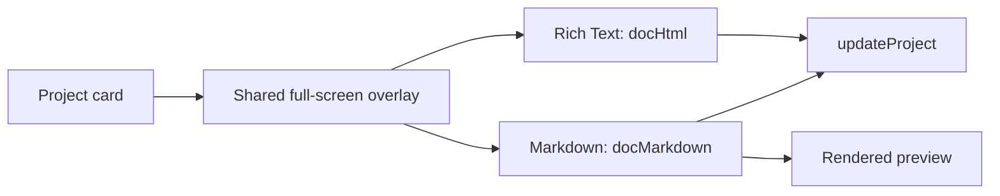
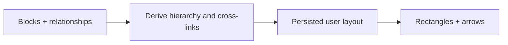

# IMP-1003 — Projects

**State:** Implemented · **Priority:** P2

## Numbered implementation

| Code | Outcome | Review evidence | Status |
|---|---|---|---|
| `IMP-1003.1` | Full-page editor | - | Implemented |
| &emsp;↳ `IMP-1003.1.1` | Shared full-screen project overlay with outside-click dismissal and contained scrolling | [FTR-1009](../../feature-review-system/reviews/FTR-1009-projects-follow-up-review.md), [FTR-1012.1](../../feature-review-system/reviews/FTR-1012-projects-content-and-layout-review.md#findings) | Implemented and verified |
| &emsp;↳ `IMP-1003.1.2` | Independent rich-text and Markdown documents with preview | - | Implemented |
| &emsp;↳ `IMP-1003.1.3` | Persist title, status, `docHtml`, and `docMarkdown` | - | Implemented |
| &emsp;↳ `IMP-1003.1.4` | **① Shared full-page/card content** and **② compact Markdown preview** | [FTR-1012](../../feature-review-system/reviews/FTR-1012-projects-content-and-layout-review.md) | Implemented and verified |
| &emsp;&emsp;↳ `IMP-1003.1.4.1` | **①** Derive the fixed-height, internally scrollable project-card mini view from the same persisted content as the full page | [FTR-1012.2](../../feature-review-system/reviews/FTR-1012-projects-content-and-layout-review.md#findings) | Implemented and verified |
| &emsp;&emsp;&emsp;↳ `IMP-1003.1.4.1.1` | Directly edit the shared Rich Text or Markdown document from the fixed-height card window without interfering with card movement | [FTR-1013.1](../../feature-review-system/reviews/FTR-1013-projects-editing-and-table-review.md#findings) | Implemented and verified |
| &emsp;&emsp;↳ `IMP-1003.1.4.2` | **②** Render safe Markdown naturally in the project-card mini view | [FTR-1012.3](../../feature-review-system/reviews/FTR-1012-projects-content-and-layout-review.md#findings) | Implemented and verified |
| `IMP-1003.2` | Typed table | [FTR-1008](../../feature-review-system/reviews/FTR-1008-projects-page-review.md) | Implemented and verified |
| &emsp;↳ `IMP-1003.2.1` | Versioned text, number, date, checkbox, and select columns | [FTR-1008](../../feature-review-system/reviews/FTR-1008-projects-page-review.md) | Implemented and verified |
| &emsp;↳ `IMP-1003.2.2` | Inline row/column editing, select options, deletion cleanup, sync, and compact control density | [FTR-1008](../../feature-review-system/reviews/FTR-1008-projects-page-review.md), [FTR-1012.4](../../feature-review-system/reviews/FTR-1012-projects-content-and-layout-review.md#findings) | Implemented and verified |
| &emsp;↳ `IMP-1003.2.3` | Minimal property and row menus with safe type conversion, editable Select options, and foreground portal placement | [FTR-1013.2](../../feature-review-system/reviews/FTR-1013-projects-editing-and-table-review.md#findings) | Implemented and verified |
| `IMP-1003.3` | Flowchart | [FTR-1008](../../feature-review-system/reviews/FTR-1008-projects-page-review.md) | Implemented and verified |
| &emsp;↳ `IMP-1003.3.1` | Spacious editable rectangular nodes, direct arrow connections, and foreground corner menus for Connect, color, and delete | [FTR-1008.3.3](../../feature-review-system/reviews/FTR-1008-projects-page-review.md#findings), [FTR-1013.3](../../feature-review-system/reviews/FTR-1013-projects-editing-and-table-review.md#findings) | Implemented and verified |
| &emsp;↳ `IMP-1003.3.2` | Persist pointer-moved positions and remove orphaned edges | [FTR-1008](../../feature-review-system/reviews/FTR-1008-projects-page-review.md), [FTR-1009](../../feature-review-system/reviews/FTR-1009-projects-follow-up-review.md) | Implemented and verified |
| &emsp;↳ `IMP-1003.3.3` | Live pointer-bound node movement and bounded persisted node resizing | [FTR-1009](../../feature-review-system/reviews/FTR-1009-projects-follow-up-review.md) | Implemented and verified |
| &emsp;↳ `IMP-1003.3.4` | Persisted Flowchart node descriptions with compact-editor and full-page entry paths | [FTR-1012.5](../../feature-review-system/reviews/FTR-1012-projects-content-and-layout-review.md#findings) | Implemented and verified |
| `IMP-1003.4` | Object mindmap | [FTR-1008](../../feature-review-system/reviews/FTR-1008-projects-page-review.md) | Implemented and verified |
| &emsp;↳ `IMP-1003.4.1` | Blank spacious idea rectangles, direct arrows, and foreground corner menus for Connect, color, and delete | [FTR-1008.3.3](../../feature-review-system/reviews/FTR-1008-projects-page-review.md#findings), [FTR-1013.3](../../feature-review-system/reviews/FTR-1013-projects-editing-and-table-review.md#findings) | Implemented and verified |
| &emsp;↳ `IMP-1003.4.2` | Persisted pointer positioning, cycle prevention, and orphaned-reference cleanup | [FTR-1008](../../feature-review-system/reviews/FTR-1008-projects-page-review.md), [FTR-1009](../../feature-review-system/reviews/FTR-1009-projects-follow-up-review.md) | Implemented and verified |
| &emsp;↳ `IMP-1003.4.3` | Separate ⚡ node-page action with independent title and page-content persistence | [FTR-1008.3.3.4](../../feature-review-system/reviews/FTR-1008-projects-page-review.md#findings) | Implemented and verified |
| &emsp;↳ `IMP-1003.4.4` | Live pointer-bound idea movement and bounded persisted idea resizing | [FTR-1009](../../feature-review-system/reviews/FTR-1009-projects-follow-up-review.md) | Implemented and verified |
| &emsp;↳ `IMP-1003.4.5` | Persisted Mindmap idea descriptions with compact-editor and full-page entry paths | [FTR-1012.5](../../feature-review-system/reviews/FTR-1012-projects-content-and-layout-review.md#findings) | Implemented and verified |
| `IMP-1003.5` | Project portfolio controls | [FTR-1008](../../feature-review-system/reviews/FTR-1008-projects-page-review.md) | Implemented and verified |
| &emsp;↳ `IMP-1003.5.1` | Confirmed project deletion available from project and contextual actions | [FTR-1008](../../feature-review-system/reviews/FTR-1008-projects-page-review.md) | Implemented and verified |
| &emsp;↳ `IMP-1003.5.2` | Direct persisted project-card drag reordering with before/after placement | [FTR-1008](../../feature-review-system/reviews/FTR-1008-projects-page-review.md), [FTR-1009](../../feature-review-system/reviews/FTR-1009-projects-follow-up-review.md) | Implemented and verified |
| &emsp;↳ `IMP-1003.5.3` | Front-card project menu opening separately persisted full-page table and graph workspaces | [FTR-1008](../../feature-review-system/reviews/FTR-1008-projects-page-review.md) | Implemented and verified |
| &emsp;↳ `IMP-1003.5.4` | All, Active, In Progress, and Done project filters | [FTR-1008](../../feature-review-system/reviews/FTR-1008-projects-page-review.md) | Implemented and verified |
| &emsp;↳ `IMP-1003.5.5` | Project-level title sorting, status grouping, and selectable Research and Launch templates beside New Project | [FTR-1009](../../feature-review-system/reviews/FTR-1009-projects-follow-up-review.md) | Implemented and verified |
| `IMP-1003.6` | Explicit **Send to AI** project-only context with visible assistant ownership and individual removal | [FTR-1009](../../feature-review-system/reviews/FTR-1009-projects-follow-up-review.md) | Implemented and verified |

| Capability | State |
|---|---|
| Project cards and status | Available |
| Rich-text / Markdown full-page editor | Implemented |
| Typed project table | Implemented and verified |
| Manual flowchart | Implemented and verified |
| Visual object mindmap | Implemented and verified |
| Portfolio deletion, ordering, mode menu, and status filters | Implemented and verified |

## Delivery record

1. Added normalized mode data while preserving legacy project cards and documents.
2. Reused the project overlay for rich text, Markdown, table, flowchart, and mindmap workspaces.
3. Added persisted typed cells and draggable rectangular Flowchart and Mindmap nodes with editable text, direct node-to-node arrows, colors, relationships, cleanup, and independent Mindmap node pages.
4. Added confirmed deletion, position-aware card dragging, sorting and template controls, a foreground card actions menu, and status filters.
5. Added project-only assistant context and live move/resize handles with bounded persisted node dimensions.
6. Unified card and full-page content, contained overlay scrolling, compacted table creation controls, and added shared compact/full-page descriptions to both graph modes.
7. Added fail-safe Projects persistence with UTF-8 upload budgeting, truthful local-only and browser-storage states, ordered acknowledgments, protected sign-out, and versioned user-scoped recovery across reload.
8. Added direct compact-document editing, a focused typed-table property workflow, and viewport-aware foreground menus across table and graph workspaces.
9. Connected compact project-document scrolling to the shared Theme Mode scrollbar contract without changing card dimensions.

**Acceptance:** all project modes persist through account sync; existing projects load unchanged; keyboard and narrow-screen workflows work; graph deletion cannot leave orphaned references.

**Verification:** the original 64-test and signed-in Projects acceptance remains valid through 2026-08-01. On 2026-08-11, focused persistence and compound-failure tests passed, and the serial isolated suite reached 91 passing tests before known shared agent-test database contamination. On 2026-08-12, the final Projects interaction suites passed 19/19, the production build and diff check passed, and DevMind approved FTR-1013. Live visual appearance, quota exhaustion, multi-tab conflicts, and browser-process recovery remain unverified.

## `IMP-1003.1` — Full-page editor

The first project-card action opens a shared full-screen overlay with independent Rich Text and Markdown documents.

| Area | Behavior |
|---|---|
| Entry | Expand action selects the project, Rich Text mode, and edit view |
| Header | Back, editable title, and project status |
| Rich Text | Uncontrolled `contentEditable` with formatting controls |
| Markdown | Full-width source editor with edit/preview toggle |
| Persistence | `docHtml` and `docMarkdown` update `ProjectBlock` and normal workspace sync |

Rich Text and Markdown stay separate to avoid lossy conversion. The uncontrolled rich editor preserves the caret; sanitization remains owned by DBG-1011.



## `IMP-1003.2` — Typed data table

| Decision | v1 default |
|---|---|
| Column types | Text, number, date, checkbox, select |
| Cell storage | Values keyed by column ID; checkbox normalized consistently |
| Editing | Controlled inline inputs |
| Actions | Add/delete row and column; edit select options |
| Deferred | Formulas, CSV export, and spreadsheet-scale behavior |

```ts
type TableDoc = {
  columns: Array<{ id: string; name: string; type: "text" | "number" | "date" | "checkbox" | "select"; options?: string[] }>;
  rows: Array<Record<string, string>>;
};
```

Store `table?: TableDoc` on `ProjectBlock`, normalize missing data, and remove deleted column keys from every row. Existing projects must load unchanged; typed edits and row/column deletion must survive reload and account sync.

## `IMP-1003.3` — Manual flowchart

Users type directly inside rectangular nodes, position them on a visual canvas, and explicitly draw directed connectors.

| Area | v1 direction |
|---|---|
| Nodes | ID, x/y position, label, optional color |
| Edges | ID, source, target, optional label; directed by default |
| Editing | Add, type, drag, click two nodes to connect, rename, delete, zoom, fit |
| Persistence | Store nodes/edges; commit positions on drag end |


The native React canvas keeps the workspace dependency-light. Deleting a node removes its connected edges; keyboard deletion, focus, zoom, and narrow-screen behavior remain acceptance requirements.

## `IMP-1003.4` — Object mindmap

Users type ideas inside blank rectangular nodes, drag them into place, and click Connect on two rectangles to draw a visible arrow without Source/Target forms.

| Area | v1 direction |
|---|---|
| Object | ID, editable title, x/y position, color, optional legacy parent, and relation IDs |
| Layout | User-positioned visual canvas with rectangular nodes |
| Rendering | Native React node canvas with directed parent and relation arrows |
| Persistence | Store nodes, positions, and relationships; preserve legacy fields without presenting unused field controls |
| Validation | Prevent missing references and identify/reject parent cycles |



```ts
type MindmapDoc = {
  objects: Array<{
    id: string;
    title: string;
    x: number;
    y: number;
    color: string;
    parentId?: string;
    relationIds: string[];
    fields: Array<{ id: string; key: string; value: string }>;
  }>;
};
```

Relationship changes cannot leave orphaned references. Saved node text, positions, colors, and relationships must survive reload; legacy field data remains preserved for compatibility.

## Engineering dependencies

Workspace growth and client recovery safeguards are verified under [SYS DBG-1007/1008](../../audit-system/SYS-1.0-system-baseline.md), while dedicated Projects persistence and server-enforced multi-device conflict handling remain open. Rich-text safety and dependency review remain owned by SEC.
