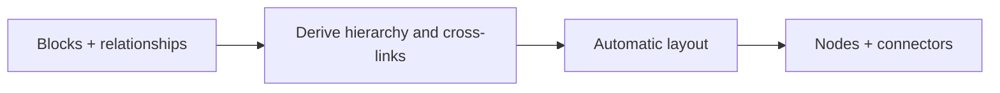

# Project Object Mindmap

**Status:** planned after the manual flowchart. This is the automatic graph: relationships define edges and the layout engine positions blocks.

## Core distinction

Users edit objects, parents, cross-links, and key/value fields; they do not draw connectors. The renderer derives edges and recomputes a readable layout.

| Area | v1 direction |
|---|---|
| Object | ID, title, optional parent, optional relation IDs, key/value fields |
| Layout | Top-down default with re-layout/fit action |
| Rendering | React Flow plus Dagre for the first hierarchical version |
| Persistence | Store blocks and relationships; recompute positions on open |
| Validation | Prevent missing references; identify or reject parent cycles |



```ts
type MindmapDoc = {
  blocks: Array<{ id: string; title: string; parentId?: string; linkIds?: string[]; fields?: Array<{ key: string; value: string }> }>;
  rootId?: string;
};
```

## Acceptance

- Add/change/delete relationships without orphaned references.
- Layout remains deterministic enough to avoid disorienting movement.
- Cross-links and cycles have defined behavior.
- Saved object data survives reload even though positions are recomputed.
