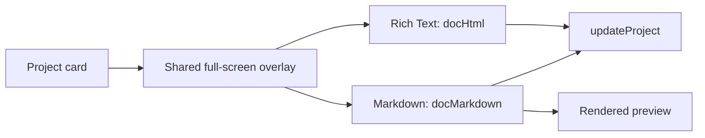

# Project Page Editor

**Status:** implemented. The first project-card action opens a full-screen editor with independent Rich Text and Markdown documents.

## Interaction model

| Area | Behavior |
|---|---|
| Entry | Expand button sets project ID, Rich Text mode, and edit view |
| Header | Back, editable title, project status |
| Rich Text | Uncontrolled `contentEditable` with basic formatting controls |
| Markdown | Full-width source editor with edit/preview toggle |
| Persistence | `docHtml` and `docMarkdown` update the project in `VaultState`, local cache, and debounced SQL sync |

Rich Text and Markdown remain separate bodies; IO Vault does not perform lossy conversion between them.

## Implementation constraint

`RichTextEditor` seeds `innerHTML` through a ref and stays uncontrolled while typing. Rebinding HTML to React state on every keystroke resets the caret. Future rich editors should preserve that behavior and add sanitization at storage/render boundaries before reuse with untrusted content.
