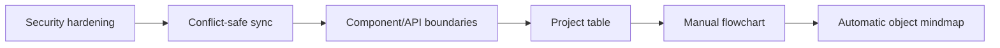

# IO Vault Roadmap

The roadmap prioritizes security and data integrity before broad feature expansion. Completed work belongs in [implementation-log.md](implementation-log.md); detailed defects belong in [debug-system](debug-system/README.md).

## Status overview

| Priority | Workstream | Status | Next outcome |
|---:|---|---|---|
| P0 | AI endpoint authentication and bounded context | **Complete** | Monitor quality and usage |
| P0 | Cookie session migration | **Complete** | Monitor CSRF/session behavior |
| P0 | Production JWT secret | Planned | Fail closed when configuration is absent |
| P0 | System-wide abuse controls | Partial | Protect auth, GitHub, and code-assistant routes |
| P1 | Conflict-safe workspace sync | Planned | Expected version + HTTP 409 workflow |
| P1 | Rich-text sanitization and API schemas | Planned | Close stored-XSS and malformed-input paths |
| P1 | Code Vault memory profiling | Planned | Baseline large-repository behavior |
| P2 | Frontend/server modularization | Planned | Smaller tested feature boundaries |
| P2 | Project table creator | Planned | Typed per-project rows and columns |
| P3 | Flowchart and object mindmap | Planned | Manual then automatic graph screens |

## Delivery sequence

## Near-term acceptance targets

### Security and persistence

Require `JWT_SECRET` in production, add route-specific quotas, sanitize rich text, and reject stale workspace saves. HttpOnly SameSite sessions and CSRF headers are complete.

### Maintainability and performance

Add characterization tests before splitting `src/App.tsx` and `server/index.js`. Profile Code Vault with realistic multi-file repositories before moving file bodies out of broad React state.

### Product expansion

Build the data table first because it requires no graph engine. Reuse one project overlay contract for the later manual flowchart and automatically laid-out object mindmap.

## Deferred

- Code execution, terminal access, dependency installation, and live preview in Code Vault.
- Local-folder access outside GitHub and scratch workspaces.
- Package/workspace splitting until deployment boundaries justify it.
