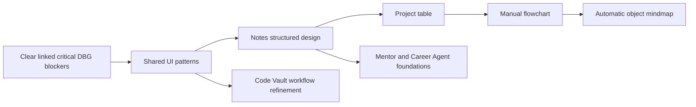

# IO Vault Roadmap

The roadmap prioritizes security and data integrity before broad feature expansion. Execution steps and page-level acceptance live in the [implementation system](implementation-system/README.md), completed work belongs in [implementation-log.md](implementation-log.md), and detailed defects belong in [debug-system](debug-system/README.md).

## Engineering risk track

The [debug system](debug-system/issue-register.md) owns status and evidence for this track.

| Priority | Outcome | Authority |
|---:|---|---|
| P0 | Production secret and system-wide abuse controls | [DBG-1004/1005](implementation-system/engineering-dependencies.md) |
| P1 | Conflict-safe storage, sanitization, and input validation | [DBG-1006/1007/1010/1011](implementation-system/engineering-dependencies.md) |
| P1 | Characterize Code Vault memory behavior | [DBG-1014](debug-system/issues/DBG-1014-monaco-and-react-state.md) |
| P2 | Reduce frontend and server monolith risk | [DBG-1008/1009](implementation-system/engineering-dependencies.md) |

## Product design track

The [implementation register](implementation-system/implementation-register.md) owns status and acceptance for this track.

| Priority | Design area | State | Next outcome |
|---:|---|---|---|
| P1 | Code Vault | Implemented v1 | Refine complete repository-change workflow |
| P1 | Notes / Write | Implemented v1 · ADT-1001 1/3 · ADT-1002 8/8 verified | Run DBG-IMP-1005/1006 for persistence and rich-text hardening |
| P1 | UI and navigation | Partial | Approve shared workspace patterns |
| P2 | Projects | Partial | Deliver typed project table before graph modes |
| P2 | Mentor Agent | Partial · agent redesign planned | Deliver conversational onboarding, adaptive teaching, assignments, and run history |
| P2 | Career Agent | Partial · agent redesign planned | Deliver resume intake, ranked opportunities, Review mode, and one supported connector |

## Delivery sequence

## Near-term acceptance targets

### Engineering readiness

Resolve only the DBG dependencies that block the next product slice. Do not duplicate their implementation steps or evidence in feature plans.

### Product expansion

Approve shared workspace patterns and the Notes model, then build the project data table because it requires no graph engine. Reuse one project overlay contract for later manual flowchart and automatically laid-out object mindmap designs.

## Deferred

- Code execution, terminal access, dependency installation, and live preview in Code Vault.
- Local-folder access outside GitHub and scratch workspaces.
- Package/workspace splitting until deployment boundaries justify it.
