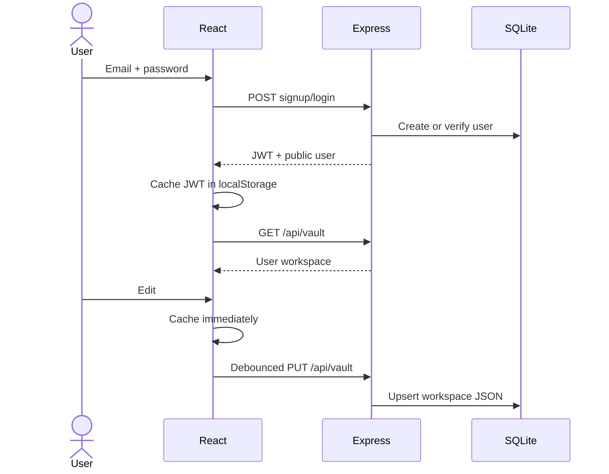

# Server, Authentication, and SQL Persistence

**Status:** implemented for local/personal v1. Production hardening remains tracked in [debug-system](debug-system/issue-register.md).

## Shipped architecture

| Area | Implementation | Primary path |
|---|---|---|
| API runtime | Express on `:8787`; Vite proxies `/api` during development | `server/index.js`, `vite.config.ts` |
| Accounts | Email/password, bcrypt hashes, signed JWTs | `server/auth.js` |
| Database | SQLite WAL database, auto-created and git-ignored | `server/db.js` |
| Workspace sync | Load after login; local cache; debounced full-state upsert | `src/App.tsx`, `/api/vault` |
| Code Vault records | GitHub installation metadata, scratch files, patch sets, publications | `server/code-db.js` |
| AI audit | User/model/outcome/size/token metadata only | `ai_usage_events` |

## Auth and sync flow

## Data model

| Table group | Purpose | Constraint |
|---|---|---|
| `users` | Account identity and password hash | Email unique |
| `workspaces` | One JSON `VaultState` per user | Whole-record upsert; no conflict version yet |
| Code Vault tables | Scratch, sessions, patches, publications, GitHub installation ID | User-scoped |
| `ai_usage_events` | Privacy-safe usage metadata | No prompts, selected context, vault content, JWTs, or secrets |

## Security behavior

- Protected routes derive user ownership from verified bearer JWTs.
- `/api/agent` requires auth, enforces user/IP limits, caps messages at 8,000 characters and selected context at 64 KB, uses a 30-second provider timeout, and returns generic upstream errors.
- General AI ignores the legacy full-vault field and receives only explicitly selected active-page context.
- GitHub App installation tokens are generated server-side and short-lived; only installation metadata is stored.

## Local configuration

| Variable | Required | Purpose |
|---|---:|---|
| `OPENAI_API_KEY` | For AI | General and Code Vault assistants |
| `JWT_SECRET` | Production | JWT signing; current dev fallback must not be used in production |
| `DATABASE_FILE` | No | Override SQLite path |
| GitHub App values in `.env.example` | For GitHub | App ID, private key, and callback/setup configuration |

The API reads environment files only at startup. Restart `npm run dev` after changes.

## Production path

1. Fail startup when production secrets are absent.
2. Replace browser-readable JWTs with HttpOnly, Secure, SameSite sessions and CSRF protection.
3. Add persistent route-specific quotas and trusted-proxy configuration.
4. Add optimistic workspace versions and HTTP 409 conflict handling.
5. Normalize high-value entities only when query/history/sharing requirements justify migration.
6. Move SQLite to managed Postgres or another shared datastore before multi-instance deployment.
