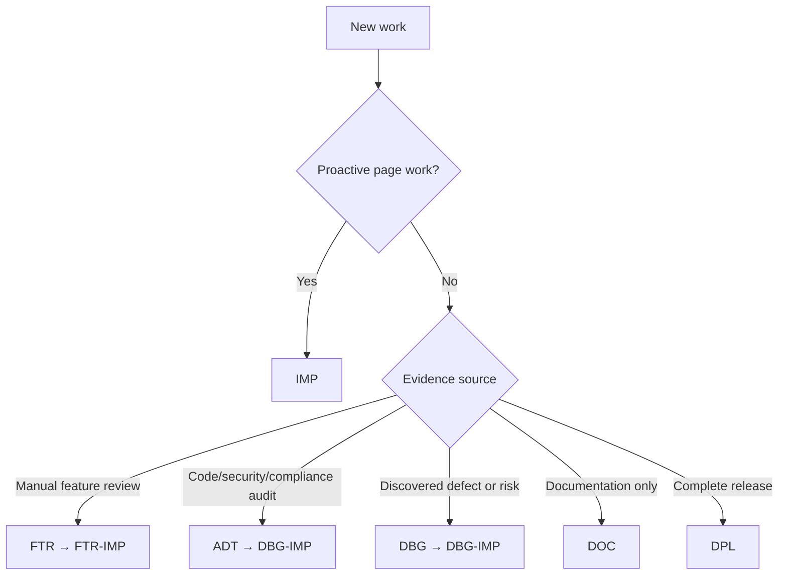

# IO Vault Work System

This directory is the authority for classifying and indexing work. Specialized systems own detailed records.

| Code | Route | Authority |
|---|---|---|
| `IMP` | Main-page design, implementation, and proactive roadmap | `implementation-system/` |
| `DBG` | Discovered technical, security, privacy, performance, cost, or maintenance problem | `debug-system/` |
| `DBG-IMP` | Correction arising from DBG or code-level ADT evidence | `debug-system/` |
| `ADT` | Full code, architecture, health, compliance, or security audit | `audit-system/` |
| `FTR` | Manual page-feature review and micro-findings | `feature-review-system/` |
| `FTR-IMP` | Correction arising from FTR | `feature-review-system/` |
| `DOC` | Documentation-only work | Existing documentation and [ledger](ledger.md) |
| `DPL` | Complete production deployment or release | `deployment-system/` |

## Rules

- Only `IMP` may contain speculative future product work.
- The five page parents are permanent: Write `IMP-1001`, Code Vault `IMP-1002`, Projects `IMP-1003`, Learning `IMP-1004`, and Career `IMP-1005`.
- Started or completed children never change. Unstarted children may be reordered as priorities change.
- Shared product work links affected IMP children; discovered technical inconsistencies become DBG records.
- Retired identifiers are never reused. Use [migration-map.md](migration-map.md) for former identifiers.
- A fix is not marked verified without recorded evidence. The [implementation log](../implementation-log.md) remains chronological.

## Routing

